# Saving (pushing) Changes to your Git Remote Repository

These instructions step you through the process of **PUSHING** your local changes to your **remote Git repository**. These instructions assume you have already **cloned** and/or **pulled** the Git repository to your local machine.

Below are two sets of instructions:

1. **Visual Studio Code (VS Code)**
2. **Visual Studio 2026 Community (VS Studio 2026 Community)**

## 1. Visual Studio Code (VS Code)

1. Clone the lab repository (or 'pull' if you have already done this)
2. Open/start the VS Code application
3. MENU: **File**...**Open Folder**

	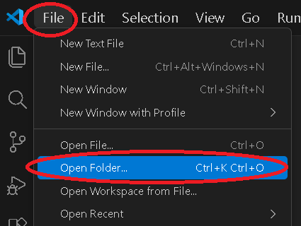	
	
	- Go to the directory path where you cloned your repository (depending on your system settings, you might see the hidden .git folder)
	- Open the cloned directory and click the "**Select Folder**" button

	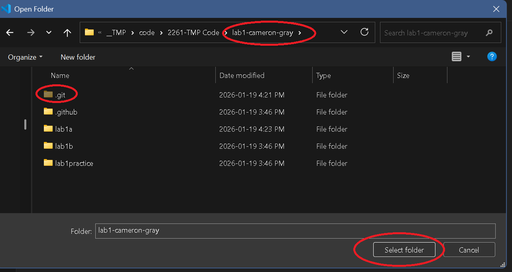
4. Modify / develop your code solution
5. Save your changes to your computer (CTRL + s) or File...Save
6. Save your changes to your Git remote repository:
	- Click the Git icon on the left-side to access the version control

		
	- **Enter a message** for your update, then click the drop-down button list:
	- **Commit and Push**:

		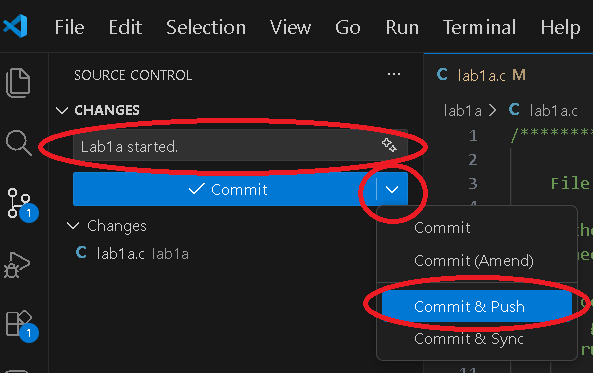

	**NOTE**: If you accidentally did only a **"Commit"**, then you will need to do the following extra step which is to click the button again which should state: **"Sync Changes..."** (which will push your changes remotely):
	
	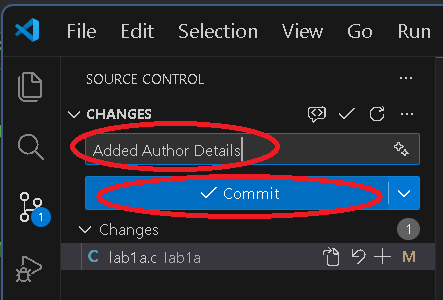
		
	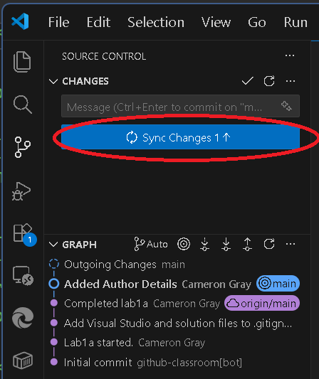

	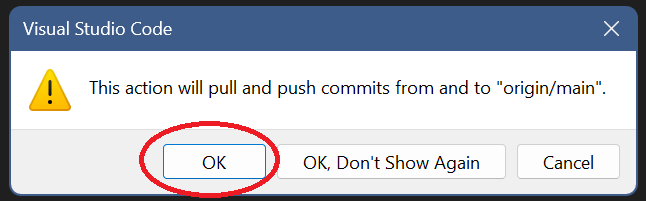
		
	- Wait for the changes to be applied to your remote GitHub repository!
7. Go back to your browser and refresh to see the applied updates.

## Visual Studio 2026 Community (VS Studio 2026 Community)

1. Clone the lab repository (or 'pull' if you have already done this)
2. Navigate to the VS Studio **project file** (included in the cloned lab), the file name ends with **".vcxproj"**
	
3. Double-click the **.vcxproj file** to open VS Studio
4. Modify / develop your code solution
5. Save your changes to your local computer: `Ctrl` + `S` or MENU: **File**...**Save**
6. Push the changes to your Git remote repository:
	- MENU: View...Git Changes (will open the panel where your solution panel is)

	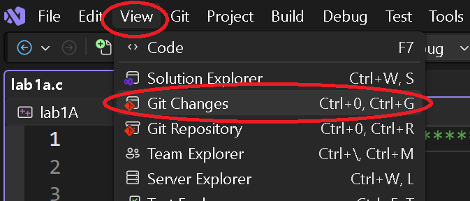

	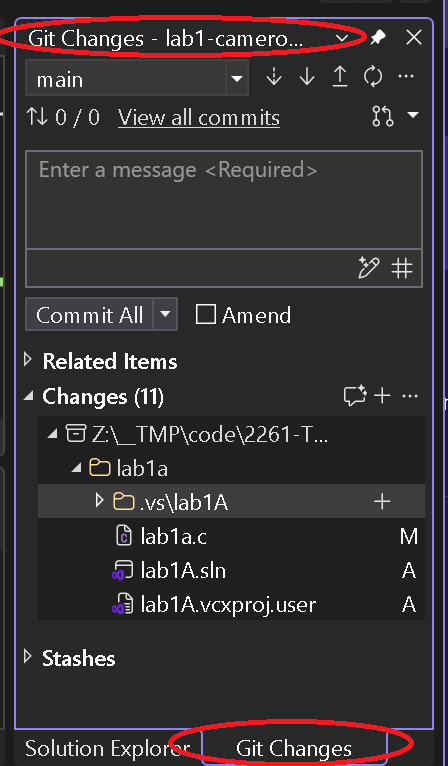
	
	- **Enter a message** for your update, then click the drop-down button list:
	- **Commit and Push**:
	
	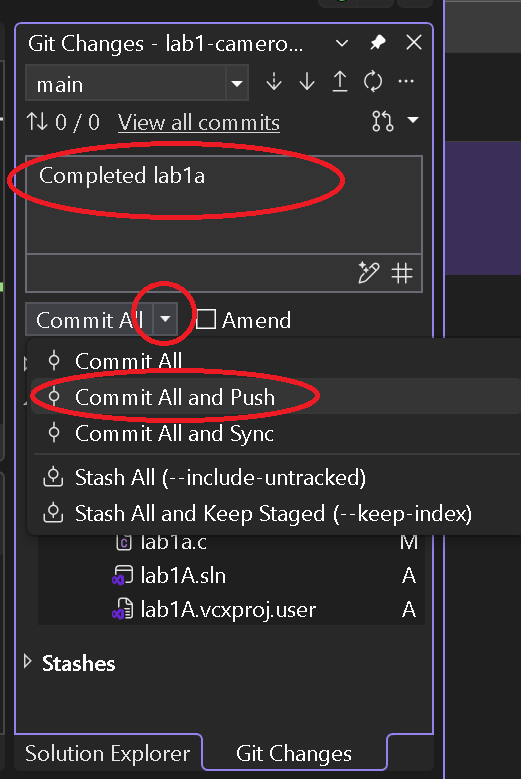

	**NOTE**: If you accidentally did only a **"Commit"**, then you will need to do the following extra step which is to click the **"Push"** button to push your changes remotely:
	
	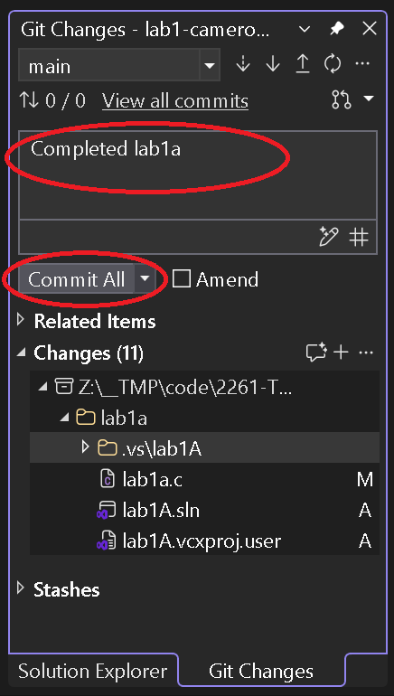
	
	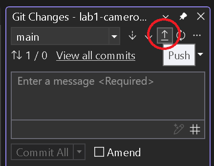
		
	- Wait for the changes to be applied to your remote GitHub repository!
	
	
7. Go back to your browser and refresh to see the applied updates.

