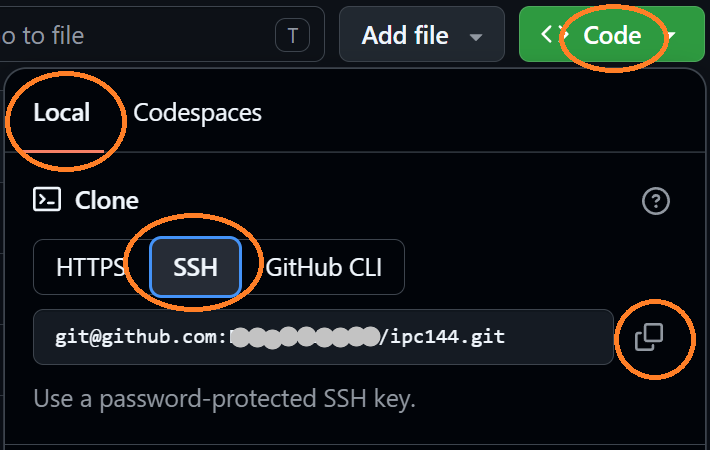
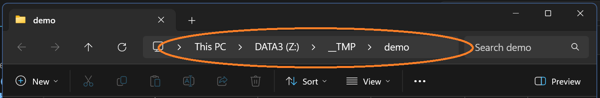
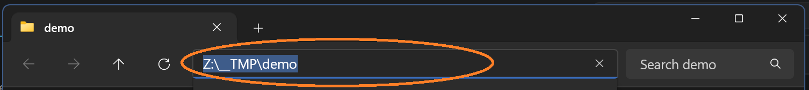
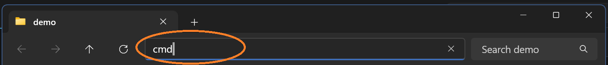
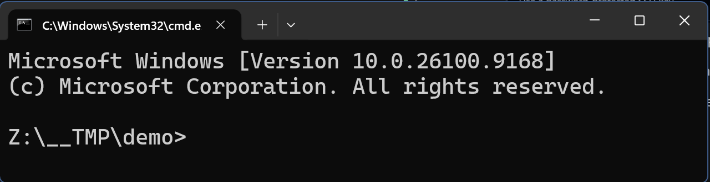
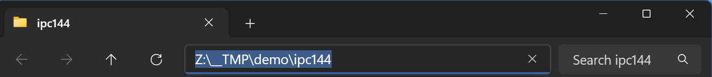
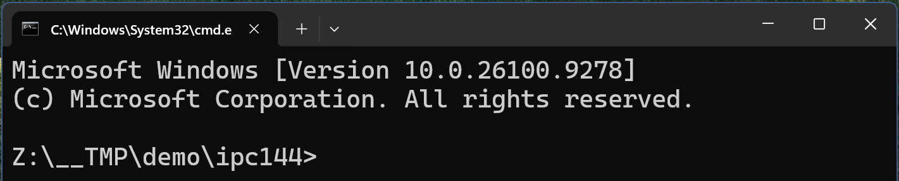

# IPC144: Lab-0 Introduction

This lab involves implementing various preparations and configurations needed for you to be ready to do your first graded lab next week (Week #2). You will also do a brief and simple coding 
exercise to practice the submission process of your work - this will be a workflow you will repeat each week to submit your work for grading.

This lab is an exercise only with no allocated marks, but is absolutely **critical** in the preparation for you to be able to submit any future labs and projects for marks.

> [!IMPORTANT]
>
> **Successful completion of this lab is MANDATORY.**
>
> The content of this lab prepares you and your device(s) with all the 
> critical parts needed to be able to submit any future labs and projects.
>


It is assumed you have completed the [Getting Started: Development Tools](https://seneca-ictoer.github.io/GettingStarted/software#development-tools) installation(s) prior to the lab. You would have received this link in your Seneca welcome email and also as an announcement from your IPC144 professor prior to the first week of classes advising you to do this in advance of your first lab class.

The most important part is the installation of the integrated development environment \(IDE\) tool for your device \(Windows: **Visual Studio Community** | MacOS: **xCode**\). These applications are very large and will take too long to install \(not to mention bog down Seneca's WIFI network\), and there will be no time for this during your lab class!

> [!CAUTION]
> 
> If you have not already downloaded and installed the IDE for your device, **DO NOT** do this during the lab class!
> 
> You will have to complete the installations **on your own time**.
> 
> In the meantime, you can still get most of this lab done, so do what you can to complete this lab while you are in class.
>

In IPC144, we don't mandate any particular IDE, but we do highly encourage an IDE to code with as these tools provide many benefits that go well beyond a basic text editor \(which is in fact, all you really need to create code with, but you need more than just an editor, you must have a C/C++ compiler which is often bundled with IDE's\).


### Learning Outcomes

Upon successful completion of this assignment, you will:

-   Create a private repository in your personal GitHub account
-   Add your professor as a collaborator to your private repository
-   Install Git tools on your device \(if not already done from [Getting Started](https://seneca-ictoer.github.io/GettingStarted)\)
-   Create SSH keys on your device(s) and in your Matrix account for easy and 
    secure access to your GitHub account
-   Clone your private repository to your Matrix account
-   Clone your private repository to your device(s)
-   Write a C program to display your Seneca student-ID, Seneca email address, and the full URL path to your GitHub private repository
-   Add and commit your C program code to your private repository on your device
-   Push your C program code upstream (remote) to GitHub
-   Pull your C program code downstream (remote) to your account on Matrix
-   Submit your C program code using the submitter program from your Matrix account


## Lab-0 Instructions

This lab will guide you through all the preparations you will need to implement to be ready for submitting your work for grades in future labs and projects. There are nine (9) major steps involved. The first eight (8) are things you will do only once and are the critical preparations needed to be able to do step nine (9) where you code and submit your work to your professor.


### Step-1. GitHub Account: New account setup

If you do not already have your own private GitHub account \(Note: Not a Seneca Enterprise GitHub account\), you will need to create one as you will need to use GitHub for many of your courses at Seneca. Follow the directions below to create your GitHub account:

1. In a browser, go to https://github.com
2. Click the button **`Sign up`** \(top-right corner\)
3. Fill out the new user information. 
	- Carefully choose a professional \"Username\" as this will be seen by potential employers in the future! This is also how you will sign-in to GitHub for authentication etc. so keep it simple and memorable.
	
> [!CAUTION]
>
> Regarding your EMAIL ADDRESS: Use a **private email address** like: GMail, Hotmail, Apple, etc.
>
> It is critical you **DO NOT** use your Seneca email address!
>

4. When you are done, click the green button: **`Create account`**

---

### Step-2. Create a PRIVATE Repository: **ipc144**

You need to create a centralized code repository on GitHub where all your lab and project coded solutions will be stored and accessible by all your other devices (and by your professor). This repository must follow a strict file structure. A repository template has been created to make this super easy for you! Follow the below directions carefully \(make sure you are logged into GitHub first\):

1. Go to the template repository: https://github.com/Seneca-IPC/IPC144-Repo-Template
2. Click the **`Use this template`** green button (top-right)
	- ...then, click the **`Create a new repository`** option

	- 1. **General Section**: Name the repository **`ipc144`** (all lowercase)
	- 2. **Configuration**: Change the repository visibility to **`PRIVATE`**
    - 3. Click the **`Create repository`** green button \(it will take a few seconds to generate your repository, so be patient\)
    
> [!CAUTION]
> 
> This is **CRITICAL**! You MUST change your repository to be **PRIVATE**.
>
> Keeping your repository to the default "public" state will result in an 
> **ACADEMIC INTEGRITY VIOLATION** as your work **MUST** be protected from public visibility.
>
> **Only you and your professor should have access to your personal coded solutions.**

3. Provide your professor access to your new **PRIVATE** repository:
    - Once the repository is created, click the **`Settings`** gear from the top menu
4. Click the `Collaborators` menu item from the left-side panel
5. In the bottom section **\"Manage Access\"**, click the button: **`Add people`**
6. Type in your professors GitHub **username**
    - **Note**: Your professor will need to provide you with this information
7. GitHub will attempt to find the account. 
    - Select the account that matched the username you entered
    
> [!NOTE]
>
> If your professor's account can't be found, you will need to return to this section later 
> when your professor can provide you with the correct username for their GitHub account.
>
> It is important this step be done otherwise, your professor will not have access to your work.

8. Click the green button **`Add to repository`** (this will provide your professor access to your repository code) 
    
    Giving your professor access to your repository provides better collaboration on your code without sending screenshots and loose files via email and chat when you wish to have deeper discussions about your code! You will learn more about Git in CEP146 later in the semester.

---

### Step-3. Git Tools

If you did not install the Git tools prior to the lab \(from [Getting Started](https://seneca-ictoer.github.io/GettingStarted/software#git-tools)\), you will need to do this now. Git tools must be installed locally on the devices (laptop and/or PC) you plan to use to interact with the **PRIVATE** ipc144 repository you created on GitHub. Depending on the operating system of your device, there are different methods you can use to install the Git tools.

#### Windows

* Git Tools: https://git-scm.com/install/windows
* Select the **`Git for Windows/x64 Setup`** link
* Execute the downloaded installer application and when prompted, apply all the defaults
* When it is done, it is a good idea to **logout** of your computer session and back in as there are environment variables that need to be active to use the git tools successfully.

> [!TIP]
> Windows users are strongly encouraged to use **`Visual Studio - Community`** as their 
> development environment to code C and C++ programs. This is NOT the same 
> as **\"Visual Studio Code\"** - Visual Studio Code is a great tool too, but best used 
> with web development.
> 

#### MacOS

If you already installed `Xcode`, the Git tools are part of the installation and you will **NOT** need to do this!

> [!TIP]
> As a reminder, it is **STRONGLY ADVISED you install Xcode** since it will also install 
> the C/C++ compiler along with the Git tools, but it is a large installation and should be 
> installed outside of the lab class time as it will take too long to do in-class \(and impact 
> Seneca's WIFI network!\)
>
> ---
> 
> If you have not installed xCode, then for the sake of this lab, you will need to install the Git 
> tools as a separate component \(thankfully, this is a very light-weight and quick installation and 
> should not conflict with your xCode installation if you have to do that later\).
>
> - Git Tools: https://git-scm.com/install/mac
> - Follow the installation instructions

---

### Step-4. Matrix: SSH Key setup
All students should have a Seneca Matrix \(Linux\) account already created \(this is automatically done as part of your enrollment into your program\). Your account on Matrix will need to be authenticated for access to your remote private GitHub repositories. This is accomplished by using a secured key (SSH key) which uniquely identifies your account on Matrix. This key will be used by GitHub to allow access from your Matrix account.

1. If you are not logged into the Seneca ecosystem (example: not on-campus using SenecaNet Wifi) be sure to connect your VPN otherwise, you will not have access to Matrix! Do not connect your VPN if you are using the SeneNet Wifi!

2. Open a terminal window (or command window):
    
    **Windows**
    - Open the start menu
    - Type **`cmd`** 
    - Press the `Enter` key or click the **`Command Prompt`** to open it

    **MacOS**
    - Press Command + Spacebar on your keyboard
    - Type the word **`Terminal`**
    - Press `Return` key or click the app icon to open it

3. Connect to matrix. **NOTE**: replace `login` with **YOUR** Seneca login name which can be found  on the left side of the @ symbol in your Seneca email:
	
    ```
    ssh login@matrix.senecapolytechnic.ca
    ```

4. Enter your Seneca password. It will appear as though your keystrokes are not being received, **BUT THEY ARE!** This is by design so type carefully - it is **CASE SENSITIVE**. 

> [!CAUTION]
> Don't make more than 3 login attempts or your account will likely be locked and 
> you will need ITS to reset your account!

5. Once you are logged in, create a special authentication key (SSH Key) for GitHub. Replace the double-quoted email address below with the email you used earlier when creating your GitHub account (these MUST MATCH):
	```
    ssh-keygen -t ed25519 -C "your_email@example.com"
    ```
    **Windows**
	- When prompted for a file name, leave the default, and press the **`Enter`** key
	- When prompted for a passphrase, leave blank, and press the **`Enter`** key **TWICE**

    **MacOS**
	- When prompted for a file name, leave the default, and press the **`Return`** key
	- When prompted for a passphrase, leave blank, and press the **`Return`** key **TWICE**

6. View the contents of the generated public key file:
	```
    cat ~/.ssh/id_ed25519.pub
    ```
7. Copy the output (highlight from "ssh-ed..." through to the end of the email address and **`COPY`**)

8. In a browser, login to GitHub (if you aren't already) and select your account orb/icon in the top-right corner

9. A menu will appear, half-way down click on **`Settings`**

10. On the left menu, select **`SSH and GPG keys`**

11. In the section **SSH keys**, click the green button **`New SSH key`**

12. Fill in the details for the SSH key:
	- **Title**: enter **\"Matrix\"**
	- **Key type**: `Authentication Key` \(this should be the default\)
	- **Key**: **`PASTE`** the public key you earlier copied from matrix

13. Click the green button **`Add SSH key`**

14. Done! You have now configured your GitHub account to accept SSH authenticated connections from your matrix account.

**NOTE**
Keep your terminal/command window open! You will need to access matrix in the following sections.

---

### Step-5. Device(s): SSH Key setup
Generating an SSH key for your device(s) is virtually the same process as taken from the previous section. Keep in mind, for every device you plan to use that will require access to your GitHub repository will need to go through these steps.

1. Open a terminal window (or command window):
    
    **Windows**
    - Open the start menu
    - Type **`cmd`** 
    - Press the `Enter` key or click the **`Command Prompt`** to open it

    **MacOS**
    - Press Command + Spacebar on your keyboard
    - Type the word **`Terminal`**
    - Press `Return` key or click the app icon to open it

2. Create a special authentication key (SSH key) for GitHub. Replace the quoted email address below with the email you used when creating your GitHub account (these MUST MATCH):
    ```
	ssh-keygen -t ed25519 -C "your_email@example.com"
    ```
    
    **Windows**
	- When prompted for a file name, leave the default, and press the **`Enter`** key
	- When prompted for a passphrase, leave blank, and press the **`Enter`** key **TWICE**

    **MacOS**
	- When prompted for a file name, leave the default, and press the **`Return`** key
	- When prompted for a passphrase, leave blank, and press the **`Return`** key **TWICE**

3. View the contents of the generated public key file:
	
    **Windows**
    - Type the following exactly:
		```
        type %userprofile%\.ssh\id_ed25519.pub
        ```
	**MacOS**
    - Type the following exactly:
		```
        cat ~/.ssh/id_ed25519.pub
        ```

4. Copy the output (highlight from "ssh-ed..." through to the end of the email address and **`COPY`**)

5. In a browser, login to GitHub (if you aren't already) and select your account orb/icon in the top-right corner

6. A menu will appear, half-way down click on **`Settings`**

7. On the left menu, select **`SSH and GPG keys`**

8. In the section **SSH keys**, click the green button **`New SSH key`**

9. Fill in the details for the SSH key:
	- **Title**: enter **\"Laptop\"** \(**NOTE**: if the device is your home PC, name it \"HomePC\" etc.\)
	- **Key type**: `Authentication Key` \(this should be the default\)
	- **Key**: **`PASTE`** the public key you earlier copied from your device terminal/command window

10. Click the green button **`Add SSH key`**

11. Done! You have now configured your GitHub account to accept SSH authenticated connections from your device.

> [!NOTE]
>
> **REMINDER**: You will have to repeat this for every device you plan to use that 
> will require access to your GitHub repository
>

---

### Step-6. Helper scripts for pushing changes
To simplify the multi-step process in managing your GitHub repository and keeping it in sync between all your devices and Matrix, a script **`gitpush`** should be used until you learn how to properly use git commands. 

You will need to install this helper script on all your devices \(but **NOT** on Matrix\) which is very easy to do using the included installer. The installation only needs to be done once per device you you plan to develop on. Choose the appropriate installer \(Windows or MacOS\) for your device.

1. Download the zip file: [git-push-utility.zip](https://github.com/Seneca-IPC/IPC144/tree/main/lab0/git-push-utility.zip) 
	
2. To download the zip file to your device, click the button with the **down arrow** \(located in the top-right-side of the content panel\):

    

3. **EXTRACT** the contents of the **\"git-push-utility.zip\"** .ZIP file to your devices filesystem. It contains a single folder/directory \"git-push-utility\" with the following structure/contents:

    ```
	git-push-utility/
	├── 📄 README.txt              <-- Simple setup instructions for both OS types
	├── 📁 Windows/                <-- Isolated Windows environment files
	│   ├── ⚙️ install.bat
	│   └── ⚙️ gitpush.bat
	└── 📁 MacOS/                  <-- Isolated Mac environment files
		├── ⚙️ install.command
		└── ⚙️ gitpush.sh
    ```
> [!CAUTION]
>
> DO NOT PROCEED if you have not **EXTRACTED** the files from the zip archived file!
>

4. Open the **`README.txt`** file with a text editor and follow the directions.

> [!TIP]
>
> The archive includes installers for both Windows and MacOS to simplify the set-up. 
> Execute only the installer that aligns to your device's operating system.
>

---

### Step-7. Matrix: Cloning the **ipc144** Repository

You will need to `clone` (copy) your GitHub **PRIVATE `ipc144`** repository only **ONCE** to your Matrix account. After cloning is done, you will use another Git command \(`pull`\) to update it when you want it refreshed and be synchronized with what is on GitHub (this will be described later).

1. In a browser, return to GitHub and login to your account if you are not already logged in.

2. View your GitHub repositories \(click your account orb/icon in top-right, and select **`Repositories`**\)

3. Click your PRIVATE **`ipc144`** repository

4. Click the green button **`Code`** 

    

    - In the mini-window that pops up, be sure the active selected tab is **`Local`** (should be the default)

    - Click the button **`SSH`** which is the middle button under the line **Clone**

    - Copy the clone address (use the quick copy icon at the end of the line)

5. Return to your terminal/command window, and type the following \(replace **`clone_url`** with the copied address from the previous step\):

	```
    git clone clone_url
    ```

6. You may receive a warning and question **\"Are you sure you want to continue connecting (yes/no)?\"**... this is okay, type `yes` followed by the `Return` key \(on MacOS\) or `Enter` key \(on Windows\)

7. You should have successfully cloned your PRIVATE **ipc144** GitHub repository to your account on matrix! To confirm, list the contents of your matrix directory (type the following):
    ```
	ls -l
    ```

8. You should see a directory called **`ipc144`** - this is your copied files from GitHub.

9. Change to the **`ipc144`** directory so you can view the contents (type the following):
	```
    cd ipc144
    ```

10. List the directory contents again (type the following):
    ```
	ls -l
    ```

11. Compare the file listing is a mirror of the contents as seen in your browser (on GitHub) - it should be identical.

---

### Step-8. Device(s): Cloning the **ipc144** Repository

You will need to `clone` (copy) your GitHub **PRIVATE `ipc144`** repository only **ONCE** to your device. After cloning is done, you will use another Git command \(`pull`\) to update it when you want it refreshed and be synchronized with what is on GitHub (this will be described later).

1. On your device...
    
    **Windows**
    - open your **`file explorer`**
    
    **MacOS**
    - open your **`finder`** 
    
    Locate a place where you want your **`ipc144`** GitHub repository to be stored. This will be where you will be coding your solutions throughout the semester, so don't forget the location!
    
> [!CAUTION]
> 
> **DO NOT** place your cloned repository in `OneDrive` or any other web-synchronized directory 
> \(example: dropbox\) as this can cause synchronization issues or even corruption to your data.
> 

2. Prepare to clone!

    **Windows**
    - Be sure your file explorer is in the directory/folder where you want to clone your ipc144 repository to. Example:

        

    - Click the file explorer **address bar** once (where the full path of your current directory is shown) and this will automatically select the full path text:

        

    - While it is all highlighted/selected, overwrite the highlighted text by typing **`cmd`** in the address bar followed by the **`Enter`**:

        

    - This will open a command window in that directory:

        
    
    **MacOS**
    - Be sure your **`finder`** is in the directory/folder where you want to clone your ipc144 repository to.
    - Open a **`terminal`** window (arrange your windows side-by-side)
    - In the terminal window type the following:

        ```
        cd "
        ```
    - From the **`finder`** window, drag and drop the folder/directory \(where you want to clone your repository to\) to the **`terminal`** window \(this will paste the full path text to your `cd` command\)
    - Return to your **`terminal`** window, and add the ending double-quote `"` to your command, followed by the **`Return`** key

3. In a browser, return to GitHub and login to your account if you are not already logged in.

4. View your GitHub repositories \(click your account orb/icon in top-right, and select **`Repositories`**\)

5. Click your PRIVATE **`ipc144`** repository

6. Click the green button **`Code`** 

    

    - In the mini-window that pops up, be sure the active selected tab is **`Local`** (should be the default)

    - Click the button **`SSH`** which is the middle button under the line **Clone**

    - Copy the clone address (use the quick copy icon at the end of the line)

7. You are now ready to clone your repository to your device! Return to your terminal/command window, and type the following \(replace **`clone_url`** with the copied address from the previous step\):

	```
    git clone clone_url
    ```

8. You should see feedback on the screen indicating the repository is copied to your device.

9. Compare the file listing as seen in your file explorer/finder with the contents as seen in your browser (on GitHub) - it should be identical.

---

### Step-9. Coding and Submission:
All the prior steps you have done are strictly a one-off \(one and done\) preparation and will not need to be done again. This next section describes the general workflow you will need to repeat for each week's lab to submit your work for grading. 

> [!IMPORTANT]
>
> For all future labs, you are expected to perform all your coding on your local device using the
> IDE you have chosen for your operating system. 
>
> While we don't mandate a single IDE all students must use, we want you using professional tooling 
> and be able to use one effectively and efficiently. We strongly direct you to the following options: 
>
> - WINDOWS: **`Visual Studio Community`** and alternatively, **`Microsoft Visual Code`**, but **only after Visual Studio Community with C/C++ configured has been installed**
>
> - MacOS  : **`xCode`** and alternatively, **`Microsoft Visual Code`**, but **only after xCode has been installed**
>

Future labs are designed for you to focus on and apply specific C concepts for a given week's topic\(s\). This lab has no independent programming assignment, but does require you to modify an existing provided program and customize it to your personal details. 

Given the simplicity of the code and the changes you will be making to it, the instructions below will bypass the compiling and testing steps on your device since how you go about performing these tasks is different based on the IDE you are using.

Therefore, using your IDE is not required for this lab.

1. **OPEN** a simple text editor \(ie: Notepad, Notepad++, Sublime, TextEdit \(in plain text mode\), etc.\) on your device. If your editor doesn't automatically create an new empty document, make sure you start a **new document** \(new unsaved text file\).

2. **CODE** your C program! The code you will be doing in this lab is going to be provided for you \(below\). Copy the below program into your text editor \(use the quick copy icon top copy it to your clipboard\).

> [!IMPORTANT]
> Be sure to **REPLACE** all the parts where you must personalize it to you **YOUR** information. This includes the commented section at the top not just the output `printf` statements within the code.

```c
/*
    Lab-0  : A simple C program to use for my first trial submission!
    
    Name   : Student Name
    Email  : studentLogin@myseneca.ca
    ID     : 123456789
    Git URL: GitLab0URL (get this from your internet browser)
*/

#include <stdio.h>

int main(void)
{
    printf("Lab-0\n"
        "---------------------------------------\n\n");

    // REPLACE: 'Student Name' with YOUR full name
    printf("Name   : Student Name\n");

    // REPLACE: 'studentLogin' with YOUR Seneca login name
    printf("Email  : studentLogin@myseneca.ca\n");

    // REPLACE: '123456789' with YOUR 9-digit Student ID number
    printf("ID     : 123456789\n");

    // REPLACE: 'GitLab0URL' with the URL to your git repo lab0 directory
    // (Copy the URL from your internet browser to the full path of your lab0 directory)
    printf("Git URL: GitLab0URL\n\n");
        
    return 0;
}
```

3. **MODIFY** the C program code where the comments indicate. Substitute all the places where your personal information should be located. There are two major sections to replace \(the upfront commented block at the top and the code section within the `main` function\)

4. **DON'T save the file yet!** You need to save the file to your **`ipc144`/`lab0`** Git repository directory. Using your text editor's `Save as` interface \(MacOS: TextEdit, use `Save`\), change to the directory/location where you cloned your ipc144 repository and open the **`lab0`** sub-directory.

    You are now ready to **SAVE** your code! You **MUST** name your C source code file **`lab0.c` exactly** - this is case-sensitive so make it all **lowercase** and should not have .txt anywhere in the name. The reason for this strict file naming practice is in preparation for the submission process which relies on exact file naming conventions.

> [!CAUTION]
>
> By default, your text editor will want to save your file as a .txt file, however, you need to make 
> this a .c file type. \(**Reminder**: the file **MUST** be named **`lab0.c` EXACTLY** and is 
> case-sensitive - make it all  **lowercase**\)
> 
> Most text editor's **`Save as`** option will allow you to override the default .txt extension 
> to whatever you want - so make sure you change the file extension to **`.c`**
>

---

> [!TIP]
>
> Normally, at this point you would be doing this using your installed IDE, where you would 
> `compile` your code and `execute` the program to test and make sure it works as it should. 
> Ideally, if there are errors at this point you want to fix them now before proceeding.
>

5. The next step is to save/update your work **REMOTELY** to your GitHub **`ipc144` PRIVATE** repository:
    
    - Open your **`file explorer`** or **`finder`**
    
    - Navigate/locate the directory where you placed your cloned GitHub **`ipc144` PRIVATE** repository. 
    
        **Windows**
        - Go into / double-click the **`ipc144`** directory so you see all the **Lab** directories.

        - Click the file explorer **address bar** once (where the full path of your current directory is shown) and this will automatically select the full path text:

            

        - While the text is all highlighted/selected, overwrite the highlighted text by typing **`cmd`** in the address bar followed by the **`Enter`**:

            

        - This will open a command window in that directory:

            

        ---

        **MacOS**
        - Open a **`terminal`** window (arrange your windows side-by-side)
        - In the terminal window type the following:

            ```
            cd "
            ```
        - From the **`finder`** window, drag and drop the **`ipc144`** folder/directory to the **`terminal`** window \(this will paste the full path text to your `cd` command\)
        - Return to your **`terminal`** window, and add the ending double-quote `"` to your command, followed by the **`Return`** key

    - It is now time to apply your local changes from your device to the remote GitHub repository! This process actually has several steps, but has been simplified using the **Helper Script `gitpush`**  installed earlier. In your command/terminal window, copy/paste or type the following:

        ```
        gitpush "Completed Lab-0 code solution"
        ```

    - You should see multiple lines of feedback indicating the repository was successfully updated

6. Before you can submit your work, you will need to connect to your MATRIX Linux account as you did earlier:

    - If you are not logged into the Seneca ecosystem (example: not on-campus using SenecaNet Wifi) be sure to connect your VPN otherwise, you will not have access to Matrix! Do not connect your VPN if you are using the SeneNet Wifi!

    - Open a terminal window (or command window):
        
        **Windows**
        - Open the start menu
        - Type **`cmd`** 
        - Press the `Enter` key or click the **`Command Prompt`** to open it

        **MacOS**
        - Press Command + Spacebar on your keyboard
        - Type the word **`Terminal`**
        - Press `Return` key or click the app icon to open it

        ---
    - Connect to matrix. **NOTE**: replace `login` with **YOUR** Seneca login name which can be found  on the left side of the @ symbol in your Seneca email:
        
        ```
        ssh login@matrix.senecapolytechnic.ca
        ```

    - Enter your Seneca password. It will appear as though your keystrokes are not being received, **BUT THEY ARE!** This is by design so type carefully - it is **CASE SENSITIVE**. 

> [!CAUTION]
> Don't make more than 3 login attempts or your account will likely be locked and 
> you will need ITS to reset your account!

7. **UPDATE** your repository: You must update your matrix account's cloned copy of your GitHub **`ipc144` PRIVATE** repository to match the changes you made from your own device earlier. To do this, change to the **`ipc144`** directory where you earlier cloned your GitHub **`ipc144` PRIVATE** repository:

	```
    cd ipc144
    ```

    - You can optionally list the directory contents to see what's there. You should see a list of directories for your labs:
        ```
        ls -l
        ```
    - Enter the below Git command to update your matrix account's copy of the remote repository on GitHub:
        ```
        git pull origin main
        ```
    - You should see multiple lines of feedback indicating the repository was successfully updated

8. **CHECK** your program: Now that your matrix account copy of your repository is updated, you can test your program in the Linux environment to make sure it works \(even though normally you would also do this on your local computer beforehand, you should always retest it again on Matrix before you attempt to submit your work to ensure it successfully compiles and works as expected in the Linux environment\). Change to the lab0 directory:

	```
    cd lab0
    ```
    - List the contents of the directory to confirm you see the **`lab0.c`** file you added from your device earlier:
        ```
        ls -l
        ```
    - Now **compile** the source code C file to create an executable binary file:
        ```
        gcc -Wall lab0.c -o lab0
        ```
    - If the compilation goes well, you should NOT see anything happen (you will return to your prompt). List the directory contents again and you should see a new file "lab0" which is the executable file of your program.
        ```
        ls -l
        ```
    - Test your program by executing the new `lab0` file:
        ```
        ./lab0
        ```
    - The output to your terminal window should show your personalized output of the code you modified earlier. Make sure all the updates you made are complete and correct. 

9. **SUBMIT** your work: It is time to submit your work using the **`submitter`** application. This is a highly structured command and you must be careful to enter the correct command reflecting **YOUR** professor and section code. The following is an example for a student who has a professor with the name **\"Seneca Professor\"** and is enrolled in the IPC144 section **\"NTT\"**:
    ```
    ~seneca.professor/submit 144lab0/lab0-NTT
    ```

    This step will launch a program used to submit your work. It will perform the following things:
    - Check to make sure the expected source code files exist \(in this case, `lab0.c`\)
    - Compile your source code file\(s\) to create an executable binary file \(in this case `lab0`\)
    - Execute your program and save the program's output to a text file \(`output.txt`\)
    - **Optionally**: the lab may be configured to **compare** your application output against a correct output file to ensure **exact correctness**. This lab is not configured to do this!
    
    If all the above is good \(required files exist, no compile errors/warnings, application runs, output matches expected output\), then you will be prompted to **CONFIRM** you want to submit your work. This requires you to enter a **`y`** or **`Y`**.
    
    After this confirmation, your work will be submitted to your professor in an email with your files attached. You will also received a copy of the email.

10. **CONFIRM** your submission: If your submission was successful, you should see an email with your copy of your submitted work. Check your email to confirm you submitted your work successfully. 

11. The final step in completing your lab submission is to paste the direct URL link to your **PRIVATE** ipc144 GitHub repository **`lab0`** directory into Blackboard. In Blackboard, open the "Labs" folder from the course main page and click on the "Lab 0" document and follow the directions.

12. This lab is now completed!
