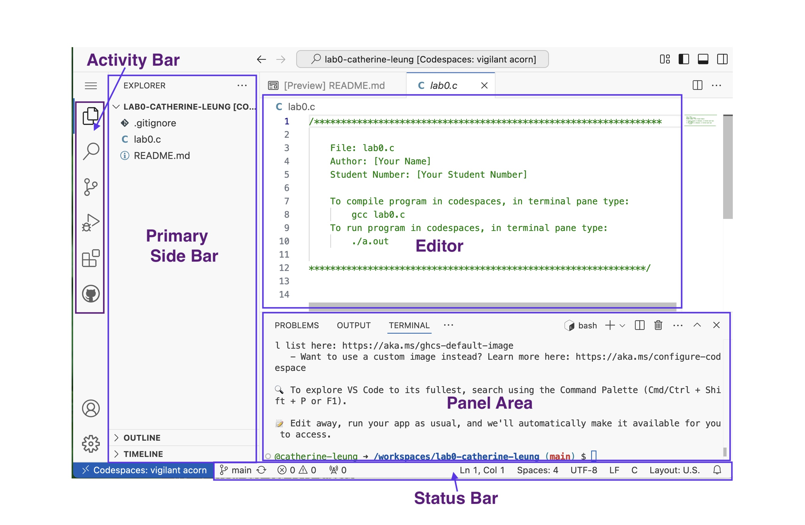
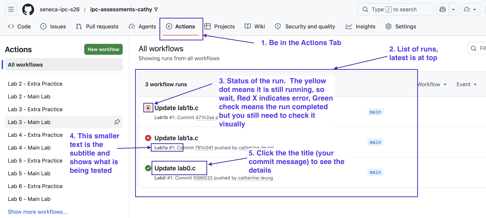
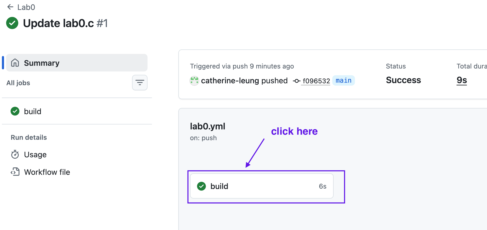
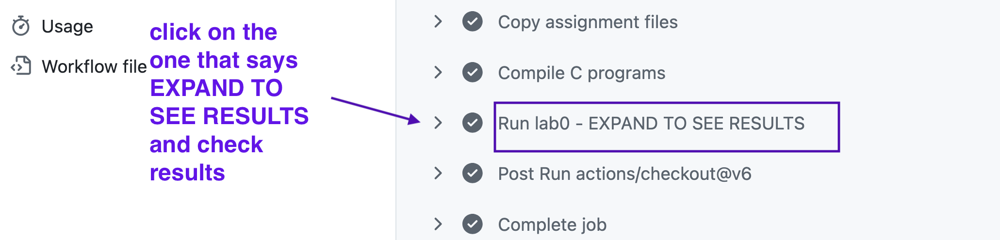
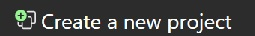
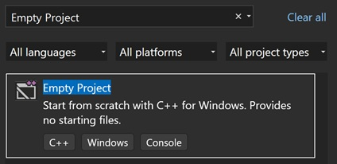
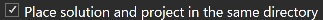

# !!! CHANGE THIS LAB !!!
This lab needs to reflect the new coding and submission process...

Refer to OOP244 Assignment0 lab as a starting point (revise and simplify).

[OOP244 set-up instructions](https://github.com/Seneca-244200/OOP-Assignments/tree/main/AS00)

---

# OLD Lab:

# Lab 0

This lab is worth 0% of your final grade

## Objectives:

This lab is designed to help you familiarize yourself with the tooling (applications) and processes involved for completing work in this course.  There is no due date and there are no marks associated with this lab. However...

>**It is essential you learn how to effectively use these tools as you will need them to be able to complete the course work.**

## Pre-lab (complete BEFORE class)

Complete these tasks at home **before the lab class**.:

See the [Getting Started Guide](https://seneca-ictoer.github.io/GettingStarted/) for details on the software you will need for this and other SCPA first semester courses.

* Install the VPN
* Install an IDE that is appropriate for your operating system
  * Visual Studio for Windows
  * XCode and/or VSCode for Macs
  * VSCode for Linux
* Install either Firefox or Chrome
* Install one of the FTP clients
* Install an ssh client

***Note: Install only the software for your operating system.***

The tools in the [Getting Started Guide](https://seneca-ictoer.github.io/GettingStarted/) are used in all your courses in your first semester, not just IPC144.  The sooner you get this done, the sooner you are ready for your classes


## Lab 0 Task Overview:

1. Get your repository for the course
2. Use a github Codespaces to write a program.
   * Apply your updates back to your repository.
   * **NOTE**: The technical terms for these steps are: "commit and push" the changes back to your repository.
3. Use a local IDE to write a program
   * Download the starter source code file from your repository.
   * Apply your updates to the source code file.
   * Update your program source code file back to your repository.

NOTE: For **step 3**, if you are working on your own laptop in the lab class at Seneca and you have not completed the **Pre-Lab** steps (ex: installed software to your laptop), use a lab computer to access Visual Studio via MyApps.

>**Do not attempt to download and install the IDE during the lab class as it will take longer than the the lab period!**

## Video Guide to Lab 0

[https://youtu.be/tT2oJ0whHgU](https://youtu.be/tT2oJ0whHgU)

## Get starter files

1. To get started, [click on this link for your work repository](https://classroom.github.com/a/UNEXMgcI)
    * you will need to be logged into your github.com account to do this.
2. Click the "Accept the assignment" button

After clicking on on the link in the starter file section above, a github repository will be created for you.  A repository is a collection of related files where version history is maintained. You will learn about git in detail in your CEP class. For now, it is good enough to know what a repository is and how to get your starter files for this class.  The repository is private and can only be accessed by you and your professors. 

The repository, will eventually hold all the work that you do in IPC 144.


### Repository Structure:
  * '.github/workflows' - **DO NOT ALTER OR REMOVE THIS FOLDER AND ITS CONTENTS**.  This folder contains scripts that allow you to submit your labs/projects. If this gets altered, you won't be able to submit your labs.
  * `labs` folder - this folder contains subfolders for each of the labs we will do
  * `practice` folder - this folder contains subfolders for extra practice problems associated with each of the labs.  Extra practice problems are there to help you re-enforce ideas.  You don't have to do them, but it is highly recommended.
  * `project` folder - this folder contains subfolders where you will place your solution for the two projects.
  * `.gitignore` - ignore this file, it is there to ensure that irrelevant files do not get copied (pushed) back into your repository.  Do not remove this file and prevents bloat.


### Lab 0 files

* The files you need in this particular lab can be found in labs/lab0
  * `lab0.c` - this file is where we will write our first program
  * `README.md` - this file shows a checklist of what you need to do for the lab.

## Use Github Codespaces to write a program

### Starting Code Space


The first 3 labs (including lab 0) will provide you with an option to use an online IDE called GitHub Codespaces.  This IDE works on every platform since the only software you will need is a modern web browser (we recommend Edge, Chrome, or FireFox).  However, we also want you to learn to use a desktop IDE so we will be turning off code spaces after lab 2.  By then, you should have a desktop IDE installed.

>**If you are planning on using an online compiler, we will only permit the use of Codespaces!**

To start a Codespace:

* Click on green code button on the right side of the code tab.
* Click on the Codespace tab.
* Click on the green "create a Codespace on main" button.

A new tab will be launched in your browser.  The first time you do this (for each lab), it will always be a bit slower but future launches will not take as long to load.

The following is what you will see when you get into your Codespace. The general areas are labeled in the image:



### Write a program:

* Using the primary side bar, navigate to the `labs/lab0` folder.
* Click on the **lab0.c** file from the **primary side bar** on the left.  This will put the file into the main **editor** window.

Write a program that displays your name and a little bit about yourself.  For example, the output of the program might be something like:

```
My name is Cathy.
I am an amateur potter (the kind where you make bowls and such).
I also teach programming which is oodles of fun.
```

This would have been produced by the following C program:

```c
#include <stdio.h>

int main(void)
{
    printf("My name is Cathy.\n");
    printf("I am an amateur potter (the kind where you make bowls and such).\n");
    printf("I also teach programming which is oodles of fun.\n");

    return 0;
}
```

Note, this task is completely customized by you!  You should not be producing the same output as above.

In Codespaces, your work is always saved automatically.  No save button is necessary.

### Compile the program and fix errors

Click in the terminal tab in the lower **Panel Area** of your Codespace.
* If you accidentally closed the **Panel Area**, click on one of these 3 icons in the **Status Bar** to bring it back up:<br>
	

In the **Panel Area**, **Terminal** Tab:

1. Navigate to the lab 0 folder:
```bash
cd labs/lab0
```
  * note that the command prompt should reflect where you are

2. Compile your program by typing the following at the prompt:
```bash
gcc -Wall lab0.c
```

The above command will compile your program.  If there are no syntax errors, you will generate a file in the same folder called ***a.out***.  This is a binary executable file.

To run the executable file, type the following at the prompt:

```bash
./a.out
```

If there is a bug (erroneous output or other unexpected outcomes), fix your bug, recompile and run your program again, repeating until you get a program that outputs what you expect.

### Update Your Repository With The Changes (commit and push your code)

When you are happy with your program results, you will need update your repository with the changes you made (commit and push your lab0.c file back into your repository).
* In the **Activity Bar** click on the source control button:
	
* Once you do that, in the **Main Side Bar** there will be a box labeled **"Message (..."**, type in a short description of what changes you made to your file(s).
* Click the button below (right-side) of the message box which will show some options - choose **"commit and push"**.
  * The first time you do this it will ask if you want to always do this, for this semester click on the "always" button to keep things simple.
* Click on the lab0.c file in your **repository** (not Codespace) to confirm the changes were applied.

> **Note: Codespaces have a time limited lifespan of only a month if you don't log into it but your repositories will continue to exist even if you don't log in for an extended period of time. This is why it is necessary to push your files back into your repository**


### Restarting your CodeSpace

Sometimes you may start some work in a Codespace but need to restart your browser.  You can get back into your code space by going to your repository:

 * Start by going here: https://github.com/seneca-ipc-s26 (it is a good idea to book mark this page)
 * Click on repository you want to continue working on.
 * In your repository, click on the green Code button, then the **Codespace tab**.  You should now see something like the following with a random name in this image it is (...).  Click on the link and it will restart the Codespace where you can continue your work.

## Checking your work in Actions

For every lab/project you do this semester, your programs must be put back into your repository for submission.  We do not have access to your codespace or to your computer.  As such, we cannot grade anything if it doesn't end up in your repository.

**When updating your repository, make sure files are not moved or renamed.  The files must be in the same folders with exactly the same file names**

What you see in your repository is what we see, so you can always look to see the state of what you are submitting.

Whenever you update the files for your labs/projects, a script will run to compile your program and do some testing, then run the executable.  The automated testing will test some components of your program but you will often need to verify that the full program works on your own.

To view results of testing:

* go to the **ACTIONS** tab in your work repository.
* Each item in the list represents a run that happened because a file got updated.
* Depending on the file modified, a different script runs.  **This is why it is essentially to not change any file names or modify the file structure**
* The title of each run corresponds to the commit message you used when you updated your repository
* The subtitle of each run states what you were testing.  This is what you should be looking at
Image below highlights these components:<br>


This is the meaning:

* If you see a red X something definitely went wrong.
* If you see a green checkmark, the program compiled but you still need to verify the results visually
* Either way click on the title
* Click on the button with the word **build**:<br>
	
* If the run had a redX, it will open showing where things went wrong.  Look at the error message to determine what to do
* If the run had a green check mark, click on the part that states **...-EXPAND TO SEE RESULTS**:

* Look at the results to see if it is as you expect or not...if not, fix and update your file.


## Use Local IDE to add to your program.

While Codespaces is really powerful and simple to use, it is often a good idea to have a back-up local development environment that does not depend on an active network connection.  It is recommended you install an IDE for your machine that runs without the internet.  Below are instructions on how to set up a project in Visual Studio (Community) on Windows and XCode on Mac's.  Please install the software appropriate to your particular operating system.  If you are using linux, please install Visual Studio Code.  It will work like Codespaces (except you will need to save your work manually).


### Download the lab0.c file

Do the following to download lab0.c from your repository:

* Go to your repository for your labs
  * Start by going here: https://github.com/seneca-ipc-s26
  * Click on your repository in the repository tab
* Navigate to the lab0 folder by clicking on labs folder then lab0 folder
* Click on lab0.c
* Click the download button (circled in the picture below for reference)
* Follow the instructions below that corresponds to your platform's local IDE.


### Using Visual Studio (if you are using Windows or a lab computer)

Code your program on your local computer:

1. Start **Visual Studio 2026** (free Community version)
2. Select **Create a new project** from the splash screen: 
3. Type **Empty Project** in the new project filter:<br> 
4. Select the C++ template with Windows and Console on the lower line:
5. Click the **NEXT** button
6. Enter **lab0** as the Project Name
7. Set the Location where you want to save the project (use the button with the ellipsis “…” to specify a different path from the default). This will create a NEW FOLDER based on the given project name.
   * **Note:** If you are using a public computer, it is **strongly** advised you use a USB removable/flash drive.
   
   * Do **NOT use OneDrive** as this will cause sync issues since OneDrive can't keep up with the changes.
8. Check the option to **Place solution and project in the same directory**: 
9. Click the button: **Create**
10. Using file explorer, copy the GitHub downloaded `lab0.c` file from earlier, into the new VS Project folder we just created.
11. From the top menu bar, select **Project** -> **Add Existing Item** (keyboard shortcut: **`<ALT> + <Shift> + A`**)
12. Select the `**lab0.c**` source code file we just copied
    * **Note:** Make sure the file extension is **ALWAYS “.c”** (This forces Visual Studio to use the C compiler)
13. Click the button **Add**
14. View the **Solution Explorer** (top menu bar, select **View** -> **Solution Explorer**, or alternatively, **`<CTRL> + W, S`**). The solution explorer window will show the new `lab0.c` file added to the **Source Files** section.
15. Double-click the `lab0.c` file from the solution explorer to load the file into the editor.
16. Enter your source code in the main window (see below for specs)
17. Compile your code: From the top menu bar, select **Build** -> **Build Solution**
    * If there are errors, fix your errors and re-attempt building (keyboard shortcut: **`<CTRL> + <Shift> + B`**)
18. If successful (bottom left corner status message), execute your program: From the top menu bar, select **Debug** -> **Start without Debugging** (keyboard shortcut: **<CTRL> + F5**)


### For XCode (Follow this if you are a Mac user)

1. Start XCode
2. On splash screen click **Create a new project**
3. At the top of the next screen
   * choose **MacOS**
   * Pick **Command Line App** from applications section
6. The next screen lets you name your project and choose the language.
   * Name your project **lab0**
   * For Language choose C from the dropdown
7. Hit **Next**
8. Choose where you want to put it and hit **Create**
9. On left is the explorer, right click on main and choose **show in finder**
10. move the lab0.c file that you downloaded from github into the same folder as the main
11. right click on lab0 and choose add file to lab0.  Pick the lab0.c file from the window
12. right click on main.c and delete it
13. add to lab0.c to produce an extra line of output
14. Hit the **Play** button (triangle pointing to right at top of screen)

(note this video only shows you how write the code into main.c, see adjustments above to add lab0.c)
**Video instructions here**: https://www.youtube.com/watch?v=yu-OCtu27I8


## Upload the Updated lab0.c File to Your GitHub Repository

* In your browser, go to your repository for lab 0.
* Click the **Add File** button (it is beside the green code button)
    * Choose: **Upload files**
* You can either drag and drop your `lab0.c` file from your computer file explorer back into your repo or click the **choose your files** link to open a file explorer.
* Click the green **Commit changes** file button
* Click on the `lab0.c` file in your repository to confirm the changes were applied.


### Submission

This lab is not worth any marks. However, if you wish to try the full submission process, copy the url of your ipc-assessments repository and paste that url into black board lab 0 submission link.

