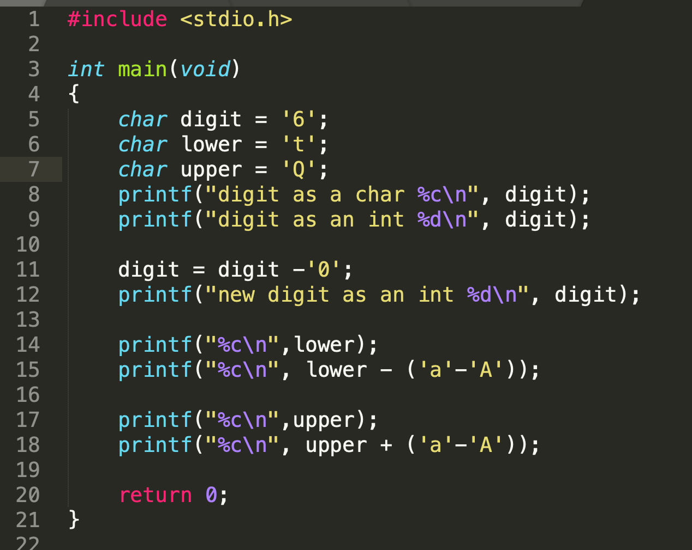
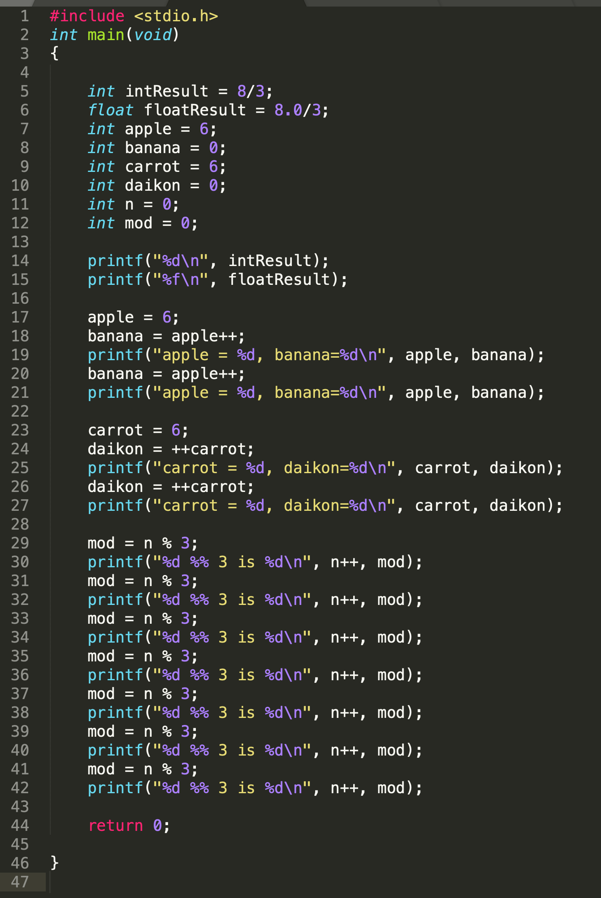

# Lab 1

This lab is worth 1.25% of your final grade

## What you need to do (by the end of the lab class): 

* Quiz: Record your answers to the in-class quiz on the paper provided to you
* Code: Update your GitHub repository:
	* With the solutions to the assigned lab work even if it is not fully functional or completed
 
## Objectives:

* Practice writing a simple program that involves input and output
* Practice writing a simple program that involves a calculation

## Expectations Going into this Lab:

To successfully complete this lab it is expected you have done the following:

* Prior to the lab, have read the listed topics for weeks 1 and 2 (see Weekly Content item on blackboard).
	* [Background](https://seneca-scpa.github.io/Introduction-To-Programming/A-Introduction/intro)
	* [Data Types](https://seneca-scpa.github.io/Introduction-To-Programming/A-Introduction/intro)
	* [Mathematical Operator](https://seneca-scpa.github.io/Introduction-To-Programming/C-Math/intro)
	* [Introduction to Code Reading](https://seneca-scpa.github.io/Introduction-To-Programming/D-ReadingAndDebugging/intro)
* Complete or nearing completion of an IDE on your own personal device.


> [!WARNING]  
> Codespaces will be turned off soon and you will need to work on your code using a properly installed IDE on your machine.

## Lab Repository

### Already did Lab-0?
If you have already have completed Lab-0 and have your **own code repository**, go directly to your repository:

- https://github.com/seneca-ipc-s26
- Navigate to the respective lab folder and code your solution using the provided starter source files.

### Didn't do Lab-0...
You must join the IPC classroom to get your coding respository. Follow these instructions to get your repository for all your assessments:
1. To get started, [click on this link for your work repository](https://classroom.github.com/a/UNEXMgcI)
2. These steps may not be required if you had done this in a previous lab.
	- Enter your **SENECA USERNAME** (the username part of your seneca email)
	<br>
	- Hit **`Create Team`** button
	- On the next page hit accept assignment.
	

## Lab Quiz Part-1

* Part-1 of lab quiz is based on the reading material for week 1 and week 2.
* Your professor will provide you with a piece of paper and project the lab quiz on the lab screen.
* Provide the answer to the questions on your paper.  You only need to number the question and write down the answer.  No need to copy the question.
* Keep the paper until the end of class so you can do the post-lab quiz on the same paper and submit this to your professor at the end of class.  
* lab quiz is part of the lab mark


## Programming


### Professor demo 1

Your professor will demonstrate the following:
* How to get your starter repository
* How to start a codespaces.
* How to edit the file in your codespaces by doing the first programming problem with you.
* How to compile the program
* How to check visually whether or not your program works within your code space
* How to update your repository with the files in your codespaces.
* How to check the actions tab to make sure your code passes testing


**It is important you follow your professor during this demo and work along with them as they do the demo.  If they are going too fast, please make sure to speak up so you can catch up.  Also if you have trouble, raise your hand to flag down your lab monitor to help you out**


### Programming Problem A: Done with your professor (45 minutes):

Please do this problem in the file: ```lab1a/lab1a.c```

> **Do not alter the name or paths of the files in your repo. Testers will not work if you do**

Follow your professors demonstration of how to write this program.

* Prompt the user to enter a temperature in degrees Celsius (a whole number)
* Calculate the Fahrenheit equivalent of that temperature, a floating point value
* Display the result including the user entered value (show the Fahrenheit result to 2 decimal places).

Use the following for the prompt

```
Please enter the temperature in Celsius: 
```

The formula for calculating the temperature is as follows:

$$F = ( {9\over5} * C) + 32$$

```
Where:

F represents the temperature in degrees Fahrenheit
C represents the temperature in degrees Celsius

```

Display the result using the following format (substituting the \<userinput\> and \<result in Fahrenheit\>):

```
<userinput> degrees Celsius is <result in Fahrenheit> degrees Fahrenheit
```

A sample run of the program is as follows (note the 0 in the first line is entered by the user).

```
Please enter the temperature in Celsius: 0
0 degrees Celsius is 32.00 degrees Fahrenheit
```

### Testing your program

* Use [Google's Celsius to Fahrenheit converter](https://www.google.com/search?client=firefox-b-d&q=Celsius+to+farenheit) to get the correct conversion to find the correct Fahrenheit value for each of your Celsius values and record them in the Fahrenheit column.
* Now it's time to test your program! Run your program using the following 5 inputs and compare the results with what you get from the online converter:
	* 0
	* 100
	* -273
	* 25
	* -17
* if your program did not work, try to fix it... check the following:
	* did you consider the data type and how the operators would work in your formula.


### Programming Problem B

Please do this problem in the file: ```lab1b/lab1b.c```


Write a program that will ask the user for a radius of a circle (a floating point number) using the prompt:

```
Please enter a radius of a circle: 
```

The data is to be read on the same line as the prompt.

The program will calculate and print the **diameter**, **circumference**, and **area** given the formulas:

* $$diameter = 2 * radius$$
* $$circumference = PI * diameter$$
* $$area = PI * (radius)^2$$

Note:
```PI is approximately 3.14159```

output all results to 2 decimal places
Use the sample run below for output format


#### Sample run

```
Please enter a radius of a circle: 123.45
The diameter of the circle with radius of 123.45 is 246.90
The circumference of the circle with radius of 123.45 is 775.66
The area of the circle with radius of 123.45 is 47877.53
```


## Quiz Part-2

Part 2 of the quiz is based on lab 1.

* Your professor will project the question(s) for quiz part-2 on the screen
* Record your answers on the same worksheet used from quiz part-1
* You only need to note the question number and your answer - there is no need to copy the question


## Submission Instructions:

* Submit to your professor your paper worksheet containing your answers to the quiz questions
	* It **must be submitted to get any marks** for the lab
* Submit your code (solution to the programming problem)
	* Update your GitHub repository with your code solution(s) even if it is not complete or functional.  Git commands to do this:
	```bash
	git add lab1*
	git commit -m "my lab 1"
	git push origin
	```
	* **This part must be submitted to be eligible for marks**
 * Submit the url of your github repository (the one with the actions tab) to blackboard. **Do not submit your codespace url!**
   	* On Blackboard for this course, go to the **Labs Content Area** and click on the **Lab1** assessment link. Paste the URL to your GitHub repository and submit


## Rubric:

To be eligible for full marks, you will need the following, (see above submission instructions for details):
 
* Score a minimum 50% on the combined questions from the quiz (parts 1 and 2 combined)
* Code must be committed and pushed (updated) back into your GitHub repository
	* Even if if it is not working or is incomplete (timestamped no later then by end of lab class)
	* Must have a green checkmark indicating a preliminary passed test (found in the **Actions** tab of your repository)
 * URL to github repo for lab 1 (not url to codespace) must be posted to blackboard.  See submission sections for details.

## Rubric Description

**In class participation is mandatory to receive any marks for the lab.  If you are not in class, you will get 0 marks even if you submit the code for the lab.**

| Grade | Description|
| ----- | -----------|
| **Unsatisfactory** | 1. Scored 0 on the quiz  `OR` <br> 2. Did not update your lab 1 repository with any code before end of lab period |
| **Incomplete** | 1.  Scored more than 0% but less than 50% on the quiz```OR``` <br> 2. Repository was updated by the end of class but did **not pass action tab tester for all parts of the main lab ** having a red X for one or more components of the main lab in the actions tab|
| **Satisfactory** |1. Scored 50% or better on the quiz ```AND```<br> 2. Repository was updated by end of the lab```AND```<br> 3. Coded solution **passed action tab tester** with a green check mark in the actions tab for all parts of main lab|


### Rubric

|  | Level: 0 | Level: 1 | Level: 2 |
| -------- | ------- | ------- | ------- |
| **Grade** | `0.0` | `0.5` | `1.0` |
| **Description** | Unsatisfactory | Incomplete | Satisfactory |


## Additional Practice Problems:

The following problems are for extra practice. It is highly advised you complete these either in-lab if you complete the main lab early, or at home. Learning to be a programmer demands a lot of practice! These extra problems will get you started, but we encourage more practice - come up with your own challenges and see if you can do it. 


### Problem 1

Write a program that will ask the user to enter 3 whole numbers.  The program will calculate the average of these three numbers.

#### Sample run:

```
Please enter the first number: 15
Please enter the second number: 18
Please enter the third number: 20
The average of 15, 18, and 20 is 17.67
```

### Problem 2a

Write a program that will calculate a weighted-grade for a course where the marks come from 3 tests.  Each test has a different weight towards the final grade as listed below:

* Test-1: 20%
* Test-2: 30%
* Test-3: 50%

Write a program that will ask the user to enter their **percentage** grade for each test then use the entered values to calculate their final grade

#### Sample run:

```
Please enter the percentage grade of the first test: 90.3
Please enter the percentage grade of the second test: 22.7
Please enter the percentage grade of the third test: 60.3
The final grade is: 55.02 %
```

### Problem 2b.  

Expanding on problem 3a, suppose each test was graded out of 50 (**raw marks**).  All scores are whole numbers out of 50 however each test is worth it's respective percentage of the course grade. Rewrite the previous problem so that it takes in the raw scores out of 50 and calculate their final grade
#### Sample run:

```
Please enter the grade of the first test out of 50: 36
Please enter the grade of the second test out of 50: 44
Please enter the grade of the third test out of 50: 33
The final grade is: 73.80 %
```

### Walkthrough 1

####  What is the output of the following program?



### Walkthrough 2


#### What is the output of the following program?

