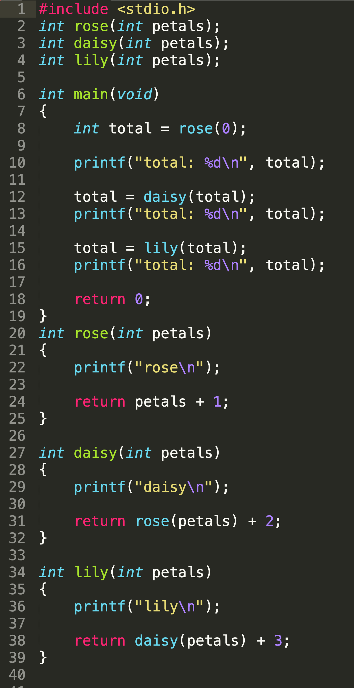
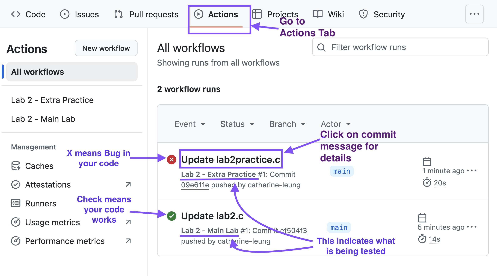
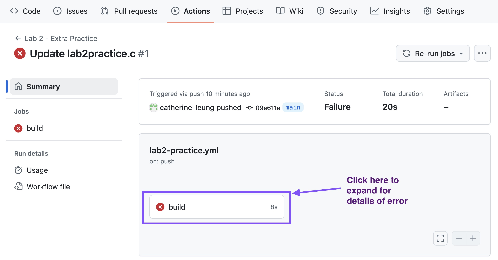
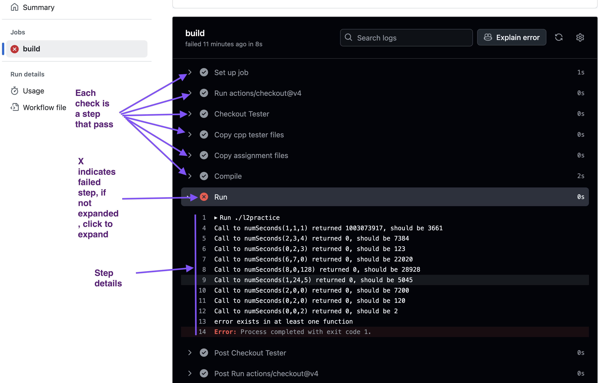
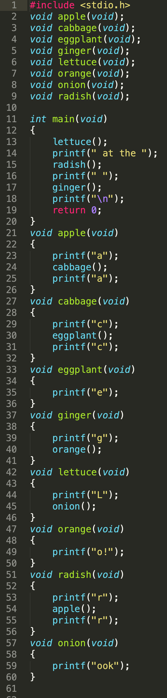

# lab 2

This lab is worth 1.25% of your final grade

## Due Date:


## What you need to do (by the end of the lab class): 

* Quiz: Record your answers to the in-class quiz on the paper provided to you
* Walkthrough: Set up tables to track variables for a walkthrough and provide the expected output of the walkthrough
* Code: Update your GitHub repository:
	* With the solutions to the assigned lab work even if it is not fully functional or completed
 
## Objectives:

* practice writing functions involving calculations
* practice reading programs that have functions and function calls

## To have the best possible outcome for lab 2:

* Prior to lab, complete all the reading listed for week 3 in your Weekly Content item on blackboard. Please read the entire chapter.  Link repeated below
	* [Functions](https://seneca-scpa.github.io/Introduction-To-Programming/E-Functions/intro)

* **If you have not yet completed the installation of your local development environment please make sure you have done so.**


> [!WARNING]  
> Codespaces will be turned off after this week and you will need to work on your code using a properly installed IDE on your machine.  Make sure you have completed your installation!


## Lab Repository

### Already did Lab-0?
If you have already have completed Lab-0 and have your **own code repository**, go directly to your repository:

- https://github.com/seneca-ipc-s26
- Navigate to the respective lab folder and code your solution using the provided starter source files.

### Didn't do Lab-0...
You must join the IPC classroom to get your coding respository. Follow these instructions to get your repository for all your assessments:
1. To get started, [click on this link for your work repository](https://classroom.github.com/a/UNEXMgcI)
2. These steps may not be required if you had done this in a previous lab.
	- Enter your **SENECA USERNAME** (the username part of your seneca email)
	<br>
	- Hit **`Create Team`** button
	- On the next page hit accept assignment.

## Quiz Part-1

* Part-1 of quiz is based on the reading material for week 3:
* Your professor will provide you with a piece of paper and project the lab quiz on the lab screen.
* Provide the answer to the questions on your paper.  You only need to number the question and write down the answer.  No need to copy the question.
* Keep the paper for the walkthrough and Lab Quiz Part 2.  

## Walkthroughs (30 minutes):

Do the walkthrough on the other side of your sheet of paper for your quizzes

What is the output of the following program?

 


### Lab Demo 1:

* Your professor will demonstrate how to set up the tables for keeping track of your variables with you.  They will demonstrate how to do this walkthrough up to and including **line 10**.  
* Complete the rest of the walkthrough **on your own**


## Programming

### Lab Demo 2:

Your professor will do the following lab demonstration:

* How to download your repository locally onto your computer
* How to set up a project in visual studio and add the files from your repository
* How to edit your source files and compile in visual studio by implementing the readLengthInInches() function in lab2.c
* How to call readLengthInInches() from lab2main.c:
* How to update your repository with the new files
* How to check that your functions fully works by looking at the actions tab


### Programming Problems (1.5 hours)

In the repository you will find the following files (there are other files, see README.md for full description)

* lab2.c - this is where your functions go
* lab2main.c - this is where you write a main() function to test your program

Once a program grows, it is often a good idea to organize the functions that we write.  the main() function is separately placed into one file, while other functions we write end up in different file(s).  Doing this allows us to separately test our functions more easily.

Once you have your starter repo, you can either: 
* spin up a code space and do the programming in there.  Note that to compile multiple source files add all .c files to your compilation statement.  In this case:

```bash
gcc -Wall lab2.c lab2main.c
```
* or, download the files and work on it locally in your platform's ide.  You will need to add all files to your project to do this in both Visual Studio and XCode.

#### Documentation

For each function below:
* Add a comment above their function prototypes in lab2.c that describes:
   * what the function does
   * what the function accepts as arguments (and any assumptions about that data)
   * what the function returns
* Write the function in lab2.c

#### Function 1

This function accepts no arguments.  It will prompt the user to enter a length measurement in inches
```
Please enter the length measurement to the nearest inch: 
```
The function will then read and return the length entered by the user.

```c
int readLengthInInches();
```

---

#### Function 2:


This function is passed a length measurement in inches.  It will return the number of whole feet in that length ```12 inches is 1 foot```.

```c
int numFeet(int lengthInInches);
```
---

#### Function 3:

This function is passed a length measurement in feet.  It will return the number of whole yards in measurement.  Note that there are ```3 feet per yard```

```c
int numYards(int lengthInFeet);
```
---

#### Function 4:

This function is passed the total length in inches and return the length's measurement in meters.

This function returns the number of meters represented by the length in in inches.  Note the following conversion:

```
1 inch is 2.54 centimeters
1 meter is 100 centimeters
```
```c
double inchesToMeters(int lengthInInches);
```
---

#### Function 5:

```c
void printResults(int lengthInInches, int lengthInFeet, int lengthInYards, double lengthInMeters);
```

This function is passed the total length in inches, the number of whole feet in the measurement, the number of Yards and the total total length in meters. This function will output the following in separate lines using the format provided:

* total length in inches, format: ```Total length: <length in inches>```
* number of whole feet in the length measurement, format: ```Length rounded to number of feet: <length in feet>```
* number of whole yards in the length measurement, format: ```Length rounded to number of yards: <length in yards>```
* total length in imperial, format: ```Total length (imperial): <yards>yd <feet>' <inch>"```
* total length in metric to 2 decimal places, format: ```Total length (metric): <lengthInMeters> m```

Note that in the above total length in imperial, the numbers for yards, feet, inch is not the same as the values in the first 3 lines of the output.  It is the entire length expressed in 3 parts.

Suppose the total inches was: ```161```

then the function would print:

```
Total length: 161
Length rounded to number of feet: 13
Length rounded to number of yards: 4
Total length (imperial): 4yd 1' 5"
Total length (metric): 4.09 m
```
---

#### The Program:

In the file lab2main.c, write a program using the functions outlined above that will prompt for a length measurement then output the various lengths as described in the printResults() function.

The program starts with a title: ```Imperial Length Measurement Converter```.  It will then prompt the user for a length in inches.  After that, it will then make all the calculations and output the result.  **This program must call and use the functions described above.**

Sample run.

```
Imperial Length Measurement Converter
Please enter the length measurement to the nearest inch: 161
Total length: 161
Length rounded to number of feet: 13
Length rounded to number of yards: 4
Total length (imperial): 4yd 1' 5"
Total length (metric): 4.09 m
```

## Quiz Part-2

Part 2 of the quiz is based on the lab.

* Your professor will project the question(s) for quiz part-2 on the screen
* Record your answers on the same worksheet used from quiz part-1
* You only need to note the question number and your answer - there is no need to copy the question


## Submission Instructions:

* Submit to your professor your paper worksheet containing your answers to the quiz questions
	* It **must be submitted to get any marks** for the lab
* Update your repository with your solution to the programming problem:
	* Here is a [guide on how to push code from Visual Studio Code and Visual Studio](../gitinstructions/gitpush.md)
 * Submit the url of your github repository (the one with the actions tab) to blackboard. **Do not submit your codespace url!**
   	* On Blackboard for this course, go to the **Labs Content Area** and click on the **Lab2** assessment link. Paste the URL to your GitHub repository and submit


### Submission testing:

When you submit your code, your program will be put through a series of tests:

#### Function testing:

Most functions will go through a final round of testing when you update your repository with your completed solution, it will trigger an automated test.  You can see the results of this automated test by going to the actions tab of your repository. These tests are designed to be thorough.  If you see a green check mark it means your function is likely to be bug free.  If you see a red X, it means that your function definitely still has flaws.  



To look at what the flaws are, click the link with the associated commit message. It will take you to a page like this



then hit the build button.  This should show you where the flaw lies



The video below will show you how to do this:

[https://youtu.be/tArP0wiWkRM](https://youtu.be/tArP0wiWkRM)

If you have a bug, take a look at the errors.  
* Was there a test case that it had that was missing in yours?
* What is the expected result?
* What did your function return?
* Walkthrough your own program using the test case and try to figure out why that one did something unexpected.
	* Was it following the expected path?  
* Apply fix as needed and test again with your tester
* Update the files to your repository

#### Program Run

Your main program will also go through a run.  In your action, you will see one that says "EXPAND TO SEE RESULT".
Click that to look at the result.  Here you will do a visual check to see if it matches expected results.  This is typically done using the example in the description.  Double check to see that all the numbers match as expected.


## Rubric:

To be eligible for full marks, you will need the following, (see above submission instructions for details):
 
* Score a minimum 50% on the combined questions from the quiz (parts 1 and 2 combined)
* Complete the walkthrough showing clear tables to track the data and clear output.
* Code must be committed and pushed (updated) back into your GitHub repository
	* Even if if it is not working or is incomplete (timestamped no later then by end of lab class)
	* Must have a green checkmark indicating a preliminary passed test (found in the **Actions** tab of your repository)
 * URL to github repo for lab 1 (not url to codespace) must be posted to blackboard.  See submission sections for details.

### Rubric Description

**In class participation is mandatory to receive any marks for the lab.  If you are not in class, you will get 0 marks even if you submit the code for the lab.**

| Grade | Description|
| ----- | -----------|
| **Unsatisfactory** | 1. Scored 0 on the quiz  `OR` <br> 2. Did not attempt walkthrough `OR` <br> 3. Did not update your lab 1 repository with any code before end of lab period |
| **Incomplete** | 1.  Scored more than 0% but less than 50% on the quiz```OR``` <br> 2. Did not complete walkthrough ```OR```<br> 3. Repository was updated by the end of class but did **not pass action tab tester for all parts of the main lab ** having a red X for one or more components of the main lab in the actions tab|
| **Satisfactory** |1. Scored 50% or better on the quiz ```AND```<br> 2. Completed walkthrough ```AND```<br> 3. Repository was updated by end of the lab```AND```<br> 3. Coded solution **passed action tab tester** with a green check mark in the actions tab for all parts of main lab|


### Rubric

|  | Level: 0 | Level: 1 | Level: 2 |
| -------- | ------- | ------- | ------- |
| **Grade** | `0.0` | `0.5` | `1.0` |
| **Description** | Unsatisfactory | Incomplete | Satisfactory |


## Additional practice problems:


### Walkthrough 2

What is the output of the following program?

<br>


### Coding Problems
As with the other programming problems, create a tester to go along with this function.
* Write your functions in lab2practice.c. **DO NOT WRITE A main() function in lab2practice.c**
* Make function calls to the functions below to test them by writing a main in lab2practicemain.c


### Problem 1

Write the following function in the file lab2practice.c:

```c
int numSeconds(int hours, int minutes, int seconds);
```
This function is passed a duration of times in terms of hours minutes and seconds.  It will return the total number of seconds in that duration.

For example:
```
suppose hours = 2, minutes = 3, seconds = 4

2 hours = 120 minutes = 7200 seconds
3 minutes = 180 seconds

Thus the total number of seconds = 7200 + 180 + 4 = 7384

```


#### Problem 2


```c
int lastDigit(int number);
```
This function is passed a whole number called **number** and it will return the last digit of that number.

For example: 

Suppose that number = 12345, function would return 5.  If number == 35361, function would return 1.  You may assume that number will be non-negative.

>**Hint: think about what mathematical operators you have... perhaps one of them will be useful to you**


---
#### Problem 3

```c
int wholeMinutes(int seconds);
```

Given an amount of time in seconds, return the number of whole minutes in that amount of time.

For example:

If seconds is 75, the function would return 1 because 75 seconds has 1 whole minute.
If seconds is 155, the function would return 2 because 155 has 2 whole minutes.
