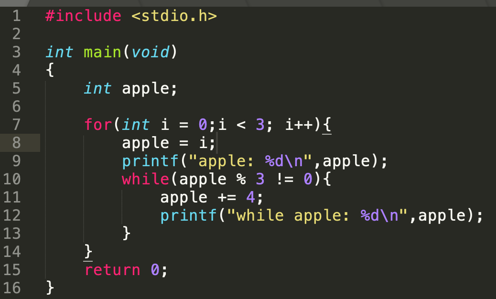
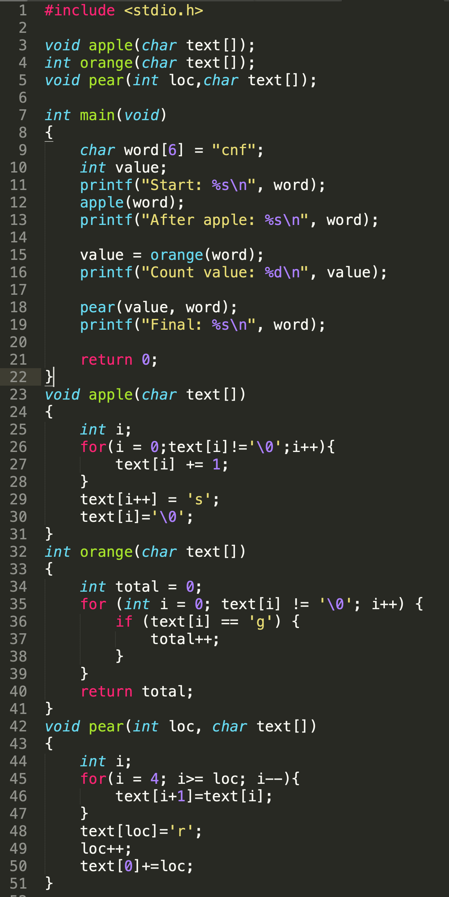
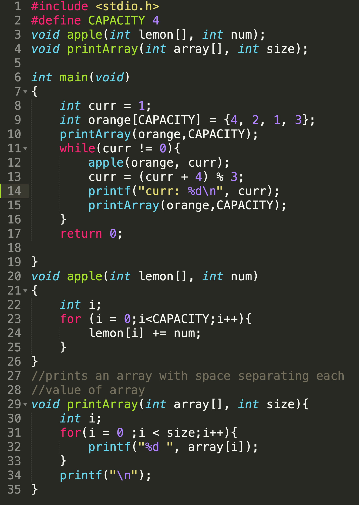
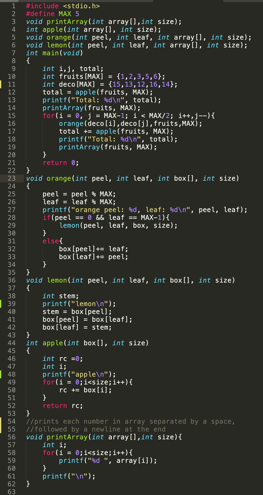

# Lab 4

This lab is worth 1.25% of your final grade

## Due Date:

* End of the lab period in week 5


## Objectives:

* practice how to find bugs in programs
* practice writing functions and programs involving iteration statements

## To have the best possible outcome for lab 4:

* Prior to lab, complete all the reading listed for week 4 in your Weekly Content item on blackboard. Please read the entire chapter.  Link repeated below
	* [Iteration](https://seneca-scpa.github.io/Introduction-To-Programming/G-Iteration/intro)


**CODESPACES have been disabled.  Please use your local development environment**


## Lab Repository

### Already did Lab-0?
If you have already have completed Lab-0 and have your **own code repository**, go directly to your repository:

- https://github.com/seneca-ipc-s26
- Navigate to the respective lab folder and code your solution using the provided starter source files.

### Didn't do Lab-0...
You must join the IPC classroom to get your coding respository. Follow these instructions to get your repository for all your assessments:
1. To get started, [click on this link for your work repository](https://classroom.github.com/a/UNEXMgcI)
2. These steps may not be required if you had done this in a previous lab.
	- Enter your **SENECA USERNAME** (the username part of your seneca email)
	<br>
	- Hit **`Create Team`** button
	- On the next page hit accept assignment.


## Quiz Part-1

* Part-1 of quiz is based on the reading material for week 5 (Chapter on Iteration)
* Your professor will provide you with a piece of paper and project the lab quiz on the lab screen.
* Provide the answer to the questions on your paper.  You only need to number the question and write down the answer.  No need to copy the question.


## Lab Demo:

* Your professor will demonstrate how to debug the following function with you.

## Debugging

Debugging is a task that many programmers have to do.  There are different errors that show up.  In general there are two category of errors:

1. **Syntactic errors** - these prevents the program from being compiled into an executable.
2. **Logical errors** - these errors prevent the program from coming up with the correct result.  

Debugging is combination of walkthrough and programming tasks...you are given code... you have to read it and you also need to be able to figure out what exactly is wrong and fix it.

### Debugging problem

Write down your solution on the back of your quiz paper.

The following is a function that accepts a whole number and returns the sum of all values from 1 to that number.  If the number provided is not positive, the function returns 0.

However, there are bugs in this function.

```c
int sumToNumber(int number)
{
	int i
	int total
	for (i = 1; i < number;i++){
		total = total + 1
	}
	return total
}

```
1. Identify all the bugs that you can find. Mark each bug as (S) for syntactic, (L) for logical.
2. provide a fix for the code so that it meets the specifications.


## Programming

### Lab Demo 2:

* Your professor will go over file organization and header files with you
* In the lab2 folder of your repository you will find 3 files:
	* `lab4.h` - function prototypes are placed in this file.  - Document your functions here
	* `lab4.c` - function definitions go here
	* `lab4main.c` - main program here.

### Overview

In this lab, you will be working on a program that will allow users to calculate some large numbers.  The program will start by presenting a menu to the user.  Once the operation is chosen from the menu, the user will be asked to enter a number for the operand.  This number will be limited to ensure result can be stored into a 32 bit signed integer.


#### Documentation

For each function below:
* Add a comment above their function prototypes in lab4.h that describes:
   * what the function does
   * what the function accepts as arguments (and any assumptions about that data)
   * what the function returns
* Implement the functions in lab4.c


#### Function 1:

```c
int readIntInRange(int min, int max);
```

This function returns a user entered number that will be within the **inclusive** valid range represented by the two numbers passed (min and max).

The function will need to prompt the user to enter an integer:

```
Please enter an integer between <min> and <max> inclusive: 
```

**NOTE**: the ```<min>``` and ```<max>``` should be replaced by the min and max numbers that were passed to the function. 

The function will read user input and validate the value is valid.  If the user input is not valid, the function will display the error message:

```
The input was not between <min> and <max>
```

**NOTE**: the ```<min>``` and ```<max>``` needs to be replaced by the values passed in for min and max. 

This logic repeats until a valid number is entered. After the number is determined to be valid, the function return the number.


##### Example 1

Suppose you call the function to get a number in the range 1 to 10:
```c
readIntInRange(1,10);
```
If the number 5 was entered on the first prompt the following would show on screen (note the 5 is user entered information and not part of the function generated output).  Also, note there is no error generated since the entered value is within the valid range.

```
Please enter an integer between 1 and 10 inclusive: 5

```

##### Example 2

Suppose you call the function to get a number in the range 10 to 25:
```c
readIntInRange(10,25);
```
Let's assume we enter the 3 numbers: 9, 26 and 25 successively at the prompts.  The function returns 25 which is valid.  The other inputs 9 and 26 are invalid, thus an error message is displayed followed by another prompt and read sequence.


```
Please enter an integer between 10 and 25 inclusive: 9
The input was not between 10 and 25
Please enter an integer between 10 and 25 inclusive: 26
The input was not between 10 and 25
Please enter an integer between 10 and 25 inclusive: 25
```
---

#### Function 2:

Write the following function

```c
int getMenuChoice(void);
```
This function will output a menu to the screen and ask the user to enter the choice (see below for exact menu and formatting).  If the user enters an invalid option, the function prints an error message and asks user to reenter.

The menu and prompt must look like this:

```
IPC Calculator
	1) Calculate 2^n
	2) Calculate n!
	3) Calculate the nth Fibonnaci number
	0) Exit
Please enter your choice: 
```

The error message when a wrong value is entered is (replace ```<input>``` with the value entered by user):

```
<input> was not a valid entry
Please enter your choice: 
```

Example:

```
IPC Calculator
	1) Calculate 2^n
	2) Calculate n!
	3) Calculate the nth Fibonnaci number
	0) Exit
Please enter your choice: 25
25 was not a valid entry
Please reenter: 15
15 was not a valid entry
Please reenter: 2
```

---


#### Function 3:

```c
int twoToPowerOfN(int n);
```
This function is passed n.  It calculates and returns 2^n.  2^n = 2 * 2 * 2...* 2 (2 multiplied together n times.  2^0 = 1
```

```
For example:

2^4 = 2 * 2 * 2 * 2 = 16


Note: Only an iterative solution to this function will be considered to be acceptable.  An iterative solution must have a loop


---


#### Function 4:

```c
int factorial(int n);
```
This function is passed n.  It calculates and returns n!.  n! = n * (n-1) * (n-2) * ... 3 * 2 * 1.  By definition 0! = 1
```

```
For example:

4! = 4 * 3 * 2 * 1 = 24

Note: Only an iterative solution to this function will be considered to be acceptable.  An iterative solution must have a loop


#### Function 5:

```c
int fibonacci(int n);

```

This function is passed a number `n` and returns the **nth** value in the fibonacci sequence (denoted as **f_n**).


The series starts with 2 sequences:

```
f_0 is 0
f_1 is 1
```
Each following sequence value is determined by summing the **prior 2 sequence values**:

```
f_2 is 1 <-- Why? (f_0 + f_1) -> (0 + 1) = 1
f_3 is 2 <-- Why? (f_1 + f_2) -> (1 + 1) = 2
f_4 is 3 <-- Why? (f_2 + f_3) -> (1 + 2) = 3
f_5 is 5 <-- Why? (f_3 + f_4) -> (2 + 3) = 5
```

**Note: Your solution MUST apply at least one loop to accomplish the task. You should be able to do this without the aid of the internet. The internet has a very popular solution for this function but does not use loops - you are not allowed to use that solution (it won't pass testing if you use it)**


Example:

```
fibonacci(3) returns 2
fibonacci(5) returns 5

```
### Program:


In the file lab4main.c, write a program using the functions outlined above that will do the following:

1. prompt the user what they wish to do
2. once user decides what to do, they must read the operand (the value used for calculations) from the user.  As the results of these calculations are very large even for small operand values, the program will prevent the user from entering anything where the results are too large to store using a 32 bit signed integer:
	* For 2^n, valid operands are between 0 to 30 inclusive
	* For n!, valid operands are between 0 to 12 inclusive
	* For the nth fibonacci, valid operands are between 0 and 45 inclusive.
3. The user will calculate the result and print it out using the following output formatting where ```<n>``` is the user entered operand and ```<result>``` is the calculated result of the operation:
	* For 2^n:
		- ```2^<n> == <result>```

	* For n!:
		- ```<n>! == <result>```

	* For fibonnacci:
		- ```F_<n> == <result>```
3.  The program then repeats the entire process until the user chooses to exit the program.

Sample run:

```
IPC Calculator
	1) Calculate 2^n
	2) Calculate n!
	3) Calculate the nth Fibonnaci number
	0) Exit 
Please enter your choice: 25
25 was not a valid entry
Please enter your choice: 15
15 was not a valid entry
Please enter your choice: 2
Please enter an integer between 0 and 12 inclusive: 13
The input was not between 0 and 12
Please enter an integer between 0 and 12 inclusive: -1
The input was not between 0 and 12
Please enter an integer between 0 and 12 inclusive: 4
4! == 24
IPC Calculator
	1) Calculate 2^n
	2) Calculate n!
	3) Calculate the nth Fibonnaci number
	0) Exit 
Please enter your choice: 1
Please enter an integer between 0 and 30 inclusive: 3
2^3 == 8
IPC Calculator
	1) Calculate 2^n
	2) Calculate n!
	3) Calculate the nth Fibonnaci number
	0) Exit 
Please enter your choice: 3
Please enter an integer between 0 and 45 inclusive: 46
The input was not between 0 and 45
Please enter an integer between 0 and 45 inclusive: 15
F_15 == 610
IPC Calculator
	1) Calculate 2^n
	2) Calculate n!
	3) Calculate the nth Fibonnaci number
	0) Exit 
Please enter your choice: 0
```


## Quiz Part-2

* Part-2 of quiz is based on what you did during the lab.
* Answer the questions on your paper


## Submission

* At the start of each lab your prof will provide you with a worksheet.
* Write your quiz answers and debug question answer on the worksheet.
* Push your code back your repository.
* Submit the worksheet to your prof.

## Rubric:

To be eligible for full marks, you will need the following, (see above submission instructions for details):
 
* Score a minimum 50% on the combined questions from the quiz (parts 1 and 2 combined)
* Complete the walkthrough showing clear tables to track the data and clear output.
* Code must be committed and pushed (updated) back into your GitHub repository
	* Even if if it is not working or is incomplete (timestamped no later then by end of lab class)
	* Must have a green checkmark indicating a preliminary passed test (found in the **Actions** tab of your repository)
 * URL to github repo for lab 1 (not url to codespace) must be posted to blackboard.  See submission sections for details.

### Rubric Description

**In class participation is mandatory to receive any marks for the lab.  If you are not in class, you will get 0 marks even if you submit the code for the lab.**

| Grade | Description|
| ----- | -----------|
| **Unsatisfactory** | 1. Scored 0 on the quiz  `OR` <br> 2. Did not attempt debugging problem `OR` <br> 3. Did not update your lab 1 repository with any code before end of lab period |
| **Incomplete** | 1.  Scored more than 0% but less than 50% on the quiz```OR``` <br> 2. Did not complete debugging problem ```OR```<br> 3. Repository was updated by the end of class but did **not pass action tab tester for all parts of the main lab ** having a red X for one or more components of the main lab in the actions tab|
| **Satisfactory** |1. Scored 50% or better on the quiz ```AND```<br> 2. Completed debugging problem ```AND```<br> 3. Repository was updated by end of the lab```AND```<br> 3. Coded solution **passed action tab tester** with a green check mark in the actions tab for all parts of main lab|


### Rubric

|  | Level: 0 | Level: 1 | Level: 2 |
| -------- | ------- | ------- | ------- |
| **Grade** | `0.0` | `0.5` | `1.0` |
| **Description** | Unsatisfactory | Incomplete | Satisfactory |


### Extra Practice Problems


---

#### Extra Practice Problem 1:

Write a function:
```c
int sum(int start, int stop);
```

This function is passed 2 whole numbers min and max.  It will return the sum of all the whole numbers between min and max inclusive. You may assume that min is always <= max.

Examples:

```
sum(2,5) returns 14 because 2 + 3 + 4 + 5 = 14
sum(-1,1) returns 0 because -1 + 0 + 1 = 0
sum(8,8) returns 8
```

#### Extra Practice Problem 2:

Write a function:
```c
int fizzBuzzScore(int endPoint);
```


This function is passed a number called endPoint.  It will return a score based on the game fizz-buzz.  Fizz-buzz is normally played by multiple players who count off numbers starting from 1 going up.

Thus the first player says "1", second player says "2" etc.  However, if a number is equally divisible by 3, the player says "Fizz" instead of the number.  If the number is equally divisible by 5, they say "Buzz" instead of the number.  And finally if the number is equally divisible by **both** 3 and 5, they say "FizzBuzz".

This function will do something similar.  It will count from 1 to **_endPoint_** inclusive and determine the "score" based on the number of "Fizz", "Buzz" and "FizzBuzz" that would have been counted. There will be no prompting for user inputs or displaying of the sequence data. The function will only determine the end score.

Scoring:
* Each "Fizz" gets 1 point
* Each "Buzz" gets 2 points
* Each "FizzBuzz" gets 5 points

Note: Only one of the three possible point values can be counted for a single number. For example, if a number qualifies as a "FizzBuzz", only 5 points are awarded (don't also add "Fizz" or "Buzz" values)!

Examples
```
fizzBuzzScore(10) - returns 7 because 
    * 3,6,9 are divisible by 3 (3 points - 1 each).  
    * 5 and 10 are both divisible by 5 (4 points - 2 each) 
    * nothing is divisible by both 3 and 5.  

fizzBuzzScore(22) - returns 17 because 
    * 3,6,9,12,18,21 are divisible by 3 (6 points - 1 each).  
    * 5, 10, 20 are all divisible by 5 (6 points - 2 each)
    * 15 is divisible by both (5 points)
```

#### Function 3:

Write the function:

```c
int sumDigits(int number);

```

This function returns the sum of the digits from the passed number.  You may assume that number is non-negative.

Example:
```
sumDigits(0) returns 0
sumDigits(123) returns 6 because 1 + 2 + 3 = 6
sumDigits(6172) returns 16 because 6 + 1 + 7 + 2 = 16 
```

HINT:  `n % 10` will give you the last digit of `n`


## Walkthrough (30 minutes)

Programs that involve iteration are more difficult to trace as it involves repeating one or more blocks of code not to mention the addition of possible function calls. This is why it is essential we use variable tables!

Trace the below program using variable tables as you have been doing in the previous labs. Also, determine the output (in a separate area on the worksheet that mimics the screen output).





## Extra practice for week 6:

Week 6 has no official lab.  It is a time for catching up on topics and preparation for the midterm test.  The following are some problems that will help you study for your midterm test.


## Walkthroughs with arrays:

Here is an example of how to do walkthroughs with arrays:

[How to do walkthroughs with arrays](arraywalk.md)

## Walkthrough 1


Trace the code and determine what the output is of the following program:




### Walkthrough 2

Trace the code and determine what the output is of the following program:



### Walkthrough 3

Trace the code and determine what the output is of the following program:


