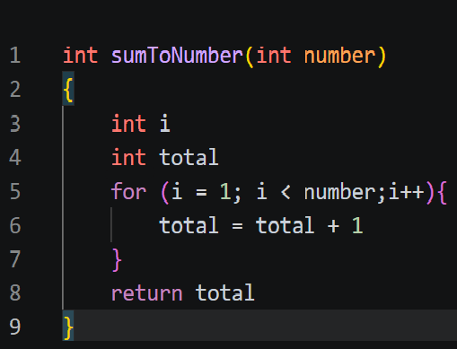
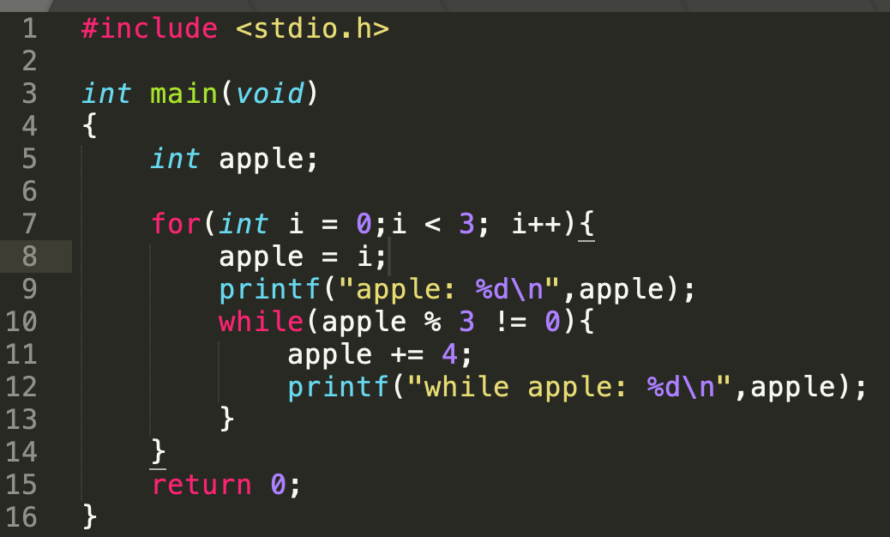
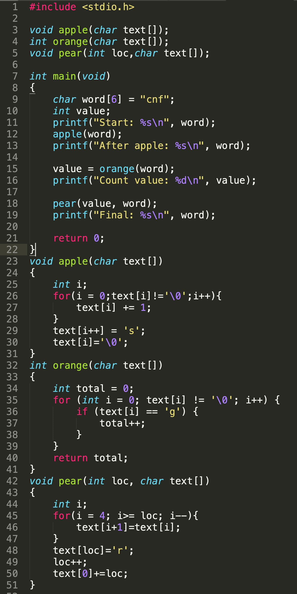
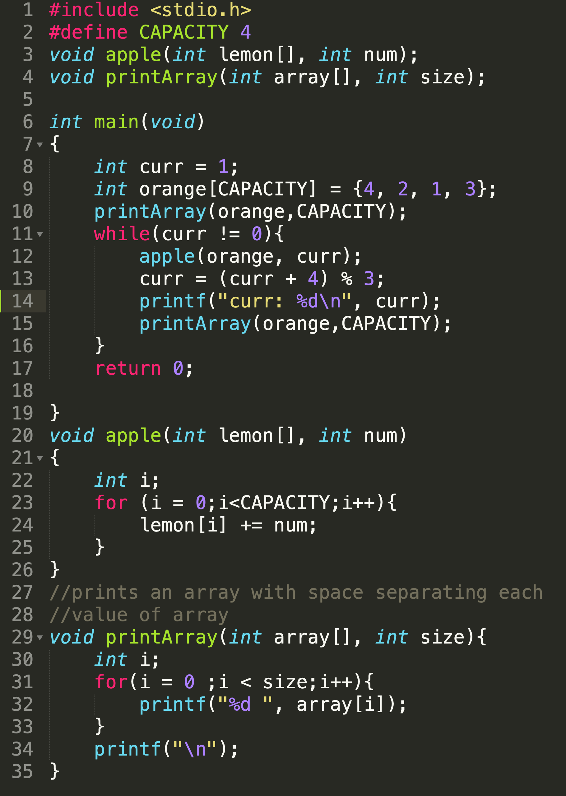
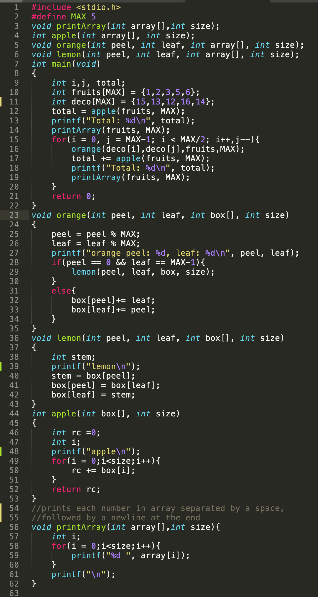

# Lab 4

This lab is worth 1.25% of your final grade

## What you need to do (by the end of the lab class): 

* Quiz: Record your answers to the in-class quiz on the paper provided to you
* Debug: Record your answer to the debug question on the paper provided to you
* Code: Update your PRIVATE GitHub ipc144 repository:
	* With the solutions to the assigned lab work even if it is not fully functional or completed
	* Submit the code using matrix submitter
	* Submit the URL to your private ipc144 GitHub repository on Blackboard
 

## Objectives:

Practice:
* How to find bugs in a program documenting the type of bug and required fix
* Writing functions for a program involving:
	- modular design at the file-level using a .h header file
	- iteration constructs

## To have the best possible outcome for lab 4:

* Prior to lab, complete all the reading listed for week 4 in your Weekly Content item on blackboard. Please read the entire chapter.  Link repeated below
	* [Iteration](https://seneca-scpa.github.io/Introduction-To-Programming/G-Iteration/intro)


## Lab Preparation

To submit your work for this lab, **YOU MUST HAVE SUCCESSFULLY COMPLETED [Lab-0](../lab0/README.md)** where you configure the tooling and learn the process involved in completing a lab and how to submit your work!

---

## Quiz Part-1

```
   ___        _          ____            _        _ 
  / _ \ _   _(_)____    |  _ \ __ _ _ __| |_     / |
 | | | | | | | |_  /    | |_) / _` | '__| __|____| |
 | |_| | |_| | |/ /     |  __/ (_| | |  | ||_____| |
  \__\_\\__,_|_/___|    |_|   \__,_|_|   \__|    |_|
```


* Part-1 of quiz is based on the reading material for week 5 (Chapter on Iteration)
* Your professor will provide you with a piece of paper and project the lab quiz on the lab screen.
* Provide the answer to the questions on your paper.  You only need to number the question and write down the answer.  No need to copy the question.

---

```
  ____                                 _             _   _             
 |  _ \  ___ _ __ ___   ___  _ __  ___| |_ _ __ __ _| |_(_) ___  _ __  
 | | | |/ _ \ '_ ` _ \ / _ \| '_ \/ __| __| '__/ _` | __| |/ _ \| '_ \ 
 | |_| |  __/ | | | | | (_) | | | \__ \ |_| | | (_| | |_| | (_) | | | |
 |____/ \___|_| |_| |_|\___/|_| |_|___/\__|_|  \__,_|\__|_|\___/|_| |_|
                                                                       
```

## Debugging Demo:

* Your professor will demonstrate how to debug the following function with you.

## Debugging

Debugging is a task that many programmers have to do.  There are different errors that show up.  In general there are two category of errors:

1. **Syntactic errors** - these prevents the program from being compiled into an executable.
2. **Logical errors** - these errors prevent the program from coming up with the correct result.  

Debugging is combination of walkthrough and programming tasks...you are given code... you have to read it and you also need to be able to figure out what exactly is wrong and fix it.

### Debugging problem

Write down your solution on the back of your quiz paper.

#### Function Specifications

The following is a function that accepts a whole number and returns the sum of all values from 1 to that number.  If the number provided is not positive, the function returns 0. However, there are bugs in this function.

<table>
  <tr>
    <th>Code With Line Numbers</th>
    <th>Quick Copy Code Sample</th>
  </tr>
  <tr>
    <td valign="top"> </a> </td>
<td>

```c
int sumToNumber(int number)
{
	int i
	int total
	for (i = 1; i < number;i++){
		total = total + 1
	}
	return total
} 
```

</td>
  </tr>
</table>

#### Your Task

Write down on the reverse side of your worksheet using this tabular format:

| Line # | Bug Category | Code Fix |
| ------ | ------------ | -------- |
| **Line # reference** | `S` or `L` | ** fixed code replacement ** |


1. Reference each specific line where there is a bug 
2. Categorize each bug as (`S`) for **syntactic**, or (`L`) for **logical**
3. provide a fix for the code meeting the specifications


## Programming

The program you will be making for this lab will allow users to calculate some large numbers. The program  presents a menu of options to the user.  Following the user's selected choice, the user will be asked to enter a number for the operand to be used in the selected operation.  This number will be limited to ensure the results can be stored to a 32-bit signed integer.

---

### Documentation

Concisely document each function **prototype**  in the `lab4.h` file (each function is described below after this section). The comment should short to avoid too many lines and should not be too detailed - only what is minimally needed to describe the function:

* Comment above each respective function PROTOTYPE that describes:
   * what the function does
   * what the function accepts as arguments (and any assumptions about that data)
   * what the function returns
* Code each function DEFINITION by copying the prototype and pasting it after the prototype section in the lab3.c file.
* For each function copied, remove the ending semi-colon `;` and replace with open and closing curly braces `{` ... `}`. **Each curly brace must be on their own respective lines.**
* Code each function's logic accordingly within the set of curly braces (code blocks).

---

### Function 1:

Prototype:

```c
int readIntInRange(int min, int max);
```

This function returns a user entered number that will be within the **inclusive** valid range represented by the two numbers passed (`min` and `max`).

The function will NOT prompt the user with instructions, but it will read the user input for an integer and  validate the input value.  If the user input is not valid, the function will display the error message:

```
Value out of range - must be between <min> and <max> inclusive: 
```

**NOTE**: the ```<min>``` and ```<max>``` needs to be replaced by the values passed in for min and max, and add a space after the colon : for the user to enter another value. 

This logic repeats until a valid number is entered. After the number is determined to be valid, the function return the number.


#### Example 1

Suppose you call the function to get a number in the range 1 to 10:
```c
printf("Please enter an integer between 1 and 10 inclusive: ");
readIntInRange(1,10);
```
If the number 5 was entered on the first read, the following would show on screen (note the 5 is user entered information and not part of the function generated output).  Also, note there is no error generated since the entered value is within the valid range.

```
Please enter an integer between 1 and 10 inclusive: 5

```

#### Example 2

Suppose you call the function to get a number in the range 10 to 25:
```c
printf("Enter the number of candies you want: ");
readIntInRange(10,25);
```
Let's assume we enter the 3 numbers: 9, 26 and 25 successively at the prompts.  The function returns 25 which is valid.  The other inputs 9 and 26 are invalid, thus an error message is displayed followed by another read sequence.


```
Enter the number of candies you want:  9
Value out of range - must be between 10 and 25 inclusive: 26
Value out of range - must be between 10 and 25 inclusive: 25
```
---

### Function 2:

Prototype:

```c
int getMenuChoice(void);
```
This function will output a menu to the screen and ask the user to enter the choice (see below for exact menu and formatting).  If the user enters an invalid option, the function prints an error message and asks user to reenter.

The menu and prompt must look like this:

```
IPC Calculator
	1) Calculate 2^n
	2) Calculate n!
	3) Calculate the nth Fibonnaci number
	0) Exit
Please enter your choice: 
```
The error message when a wrong value is entered is:

```
Value out of range - must be between 0 and 3 inclusive: 
```

Example:

```
IPC Calculator
	1) Calculate 2^n
	2) Calculate n!
	3) Calculate the nth Fibonnaci number
	0) Exit
Please enter your choice: 25
Value out of range - must be between 0 and 3 inclusive: 15
Value out of range - must be between 0 and 3 inclusive: 2
```

---


### Function 3:

Prototype:

```c
int twoToPowerOfN(int n);
```

This function is passed `n`.  It calculates and returns 2 to the power of `n`.  2^n = 2 * 2 * 2...* 2 \(2 multiplied together n times\).  Your logic should account for the possibility of the power to zero \(n=0\) which should result in 1 \(2^0 = 1\).

For example:

```c
twoToPowerOfN(4); // returns 16
```

Because:
2^4 = 2 * 2 * 2 * 2 = 16

> [! NOTE]
> 
> Only an iterative solution to this function will be considered to be acceptable.  An iterative solution must have a loop construct
> 

---


### Function 4:

Prototype:

```c
int factorial(int n);
```

This function is passed `n`.  It calculates and returns n!.  n! = n * (n-1) * (n-2) * ... 3 * 2 * 1.  By definition 0! = 1

For example:

```c
factorial(4);  // returns 24
```

Because: 4! = 4 * 3 * 2 * 1 = 24

> [! NOTE]
> 
> Only an iterative solution to this function will be considered to be acceptable.  An iterative solution must have a loop construct
> 


### Function 5:

Prototype:

```c
int fibonacci(int n);

```

This function is passed a number `n` and returns the **nth** value in the fibonacci sequence (denoted as **f_n**).


The series starts with 2 sequences:

```
f_0 is 0
f_1 is 1
```
Each following sequence value is determined by summing the **prior 2 sequence values**:

```
f_2 is 1 <-- Why? (f_0 + f_1) -> (0 + 1) = 1
f_3 is 2 <-- Why? (f_1 + f_2) -> (1 + 1) = 2
f_4 is 3 <-- Why? (f_2 + f_3) -> (1 + 2) = 3
f_5 is 5 <-- Why? (f_3 + f_4) -> (2 + 3) = 5
```

> [! CAUTION]
> 
> **IMPORTANT**:
> 
> Your solution MUST apply at **least one loop**  (when `n` is more than 1) to accomplish the task. You should be able to do this without the aid of the internet or AI. The internet and AI tools have a very popular solution for this function but does not use loops - you are not allowed to use that solution (**FYI: it won't pass testing if you use it**)


Example:

```c
fibonacci(3); // returns 2 
fibonacci(5); // returns 5

```

---

```
  ____                                 _             _   _             
 |  _ \  ___ _ __ ___   ___  _ __  ___| |_ _ __ __ _| |_(_) ___  _ __  
 | | | |/ _ \ '_ ` _ \ / _ \| '_ \/ __| __| '__/ _` | __| |/ _ \| '_ \ 
 | |_| |  __/ | | | | | (_) | | | \__ \ |_| | | (_| | |_| | (_) | | | |
 |____/ \___|_| |_| |_|\___/|_| |_|___/\__|_|  \__,_|\__|_|\___/|_| |_|
                                                                       
```

### Getting Started:

* Your professor will go over the file organization \(incorporates a **`header file`**\)
* In the lab4 `code` folder you will find 3 starter files:
	* `lab4.h` - function prototypes are placed in this file.  - Document your functions here
	* `lab4.c` - function definitions go here
	* `lab4main.c` - main program here.

---

```
  ___ _   _      __   __                 _____                         
 |_ _| |_( )___  \ \ / /__  _   _ _ __  |_   _|   _ _ __ _ __          
  | || __|// __|  \ V / _ \| | | | '__|   | || | | | '__| '_ \         
  | || |_  \__ \   | | (_) | |_| | |      | || |_| | |  | | | |  _ _ _ 
 |___|\__| |___/   |_|\___/ \__,_|_|      |_| \__,_|_|  |_| |_| (_|_|_)
                                                                       
```

### Program the Functions

Code all the functions described above and test each one as you complete them. Don't forget to DOCUMENT each function PROTOTYPE (lab4.h file).

After you complete the functions, assemble a program implementing those functions as required. See the next section.

---

### Program Implementation/Execution:

In the file lab4main.c, write a program using the functions outlined above that will do the following:

1. Prompt the user what they wish to do (menu selection)
2. Get user-input for the operand number (the value to be used for selected operation).  Given the results of these calculations can potentially be very large even for small operand values, the program enforces a limit based on the specifc operation chosen to ensure the results will fit a 32 bit signed integer:
	* For 2^n, valid operands are between 0 to 30 inclusive
	* For n!, valid operands are between 0 to 12 inclusive
	* For the nth fibonacci, valid operands are between 0 and 45 inclusive.
3. The program calculates the result and print it out using the following output formatting where ```<n>``` is the user entered operand and ```<result>``` is the calculated result of the operation:
	* For 2^n:
		- ```2^<n> == <result>```

	* For n!:
		- ```<n>! == <result>```

	* For fibonnacci:
		- ```F_<n> == <result>```
3.  The program then repeats the entire process until the user chooses to exit the program.

Sample run:

```
IPC Calculator
	1) Calculate 2^n
	2) Calculate n!
	3) Calculate the nth Fibonnaci number
	0) Exit 
Please enter your choice: 25
Value out of range - must be between 0 and 3 inclusive: 15
Value out of range - must be between 0 and 3 inclusive: 2
Please enter an integer between 0 and 12 inclusive: 13
Value out of range - must be between 0 and 12 inclusive: -1
Value out of range - must be between 0 and 12 inclusive: 4
4! == 24
IPC Calculator
	1) Calculate 2^n
	2) Calculate n!
	3) Calculate the nth Fibonnaci number
	0) Exit 
Please enter your choice: 1
Please enter an integer between 0 and 30 inclusive: 3
2^3 == 8
IPC Calculator
	1) Calculate 2^n
	2) Calculate n!
	3) Calculate the nth Fibonnaci number
	0) Exit 
Please enter your choice: 3
Please enter an integer between 0 and 45 inclusive: 46
Value out of range - must be between 0 and 45 inclusive: 15
F_15 == 610
IPC Calculator
	1) Calculate 2^n
	2) Calculate n!
	3) Calculate the nth Fibonnaci number
	0) Exit 
Please enter your choice: 0
```

---

## Submission Instructions:

```
  ____        _               _         _             
 / ___| _   _| |__  _ __ ___ (_)___ ___(_) ___  _ __  
 \___ \| | | | '_ \| '_ ` _ \| / __/ __| |/ _ \| '_ \ 
  ___) | |_| | |_) | | | | | | \__ \__ \ | (_) | | | |
 |____/ \__,_|_.__/|_| |_| |_|_|___/___/_|\___/|_| |_|
                                                      
```

* Submit your code (solution to the programming problem)

	- Update your GitHub PRIVATE ipc144 repository with your solution to the programming problem:
		- Here is an EASY [guide on how to push code from Visual Studio Code and Visual Studio](../gitinstructions/gitpush.md)
		- If you are not using the above IDE's, manually perform the 3-git commands (from anywhere within your repository directory structure):
			```
			git add -A
			git commit -am "Completed lab3"
			git push origin main
			```

	- Connect to **matrix**: 
		- Open a command prompt (or terminal) window
		- Type the following connection command and substitute `loginName` with YOUR Seneca login name!
		```
		SSH loginName@matrix.senecapolytechnic.ca
		```
	- Change to the directory where you cloned your ipc144 repository (use the `cd` command accordingly)
	- Update the matrix copy of your PRIVATE ipc144 GitHub repository:
		```
		git pull origin main
		```
	- Change to the `lab4` directory (inside your ipc144 repository):
		```
		cd lab4
		```
	- Submit your code using the submitter. Substitute `professor.name` with your professor\'s account name, and `NQQ` with your course section code:
		```
		~professor.name/submit 144lab4/lab4-NQQ
		```
	- Follow the directions to submit your code.

		- **IMPORTANT**: Your application will be compiled and executed by the submitter. It will be an interactive session meaning it will require you to provide the necessary user input(s) to demonstrate your program works (use the values stated by the submitter).

	- If there are errors or your submission failed to submit, fix the problems **ON YOUR DEVICE**, and repeat the above submission process again from the beginning.
	
 * Lastly, on **Blackboard** paste the URL (link) to the **lab4** directory of your PRIVATE ipc144 GitHub repository by clicking the `Lab-4` assignment under the **Labs** section of your repository.

> [!IMPORTANT]
>
> **DO NOT modify your code directly from matrix** as this will put your repository out of sync
> with the copy of your code on GitHub.
>
> You will learn later in the semester in your course CEP146 how to use Git and GitHub properly.

> [!CAUTION]	
>
> **Only submissions done from matrix will be accepted and eligible for marks**


---


```
   ___        _          ____            _       ____  
  / _ \ _   _(_)____    |  _ \ __ _ _ __| |_    |___ \ 
 | | | | | | | |_  /    | |_) / _` | '__| __|____ __) |
 | |_| | |_| | |/ /     |  __/ (_| | |  | ||_____/ __/ 
  \__\_\\__,_|_/___|    |_|   \__,_|_|   \__|   |_____|
                                                       
```


## Quiz Part-2

* Part-2 of quiz is based on what you did during the lab.
* Answer the questions on your paper

---

```
   ____               _ _                  ____        _          _      
  / ___|_ __ __ _  __| (_)_ __   __ _     |  _ \ _   _| |__  _ __(_) ___ 
 | |  _| '__/ _` |/ _` | | '_ \ / _` |    | |_) | | | | '_ \| '__| |/ __|
 | |_| | | | (_| | (_| | | | | | (_| |    |  _ <| |_| | |_) | |  | | (__ 
  \____|_|  \__,_|\__,_|_|_| |_|\__, |    |_| \_\\__,_|_.__/|_|  |_|\___|
                                |___/                                    
```

## Rubric Details:

To be eligible for **FULL MARKS**, you will need to satisfy the following:
 
* Score a minimum 50% on the combined questions from the quiz (parts 1 and 2 combined)
* Code must be pushed (updated) back into your PRIVATE **ipc144** GitHub repository
* Code must be **submitted by the matrix submitter**
* Code must **solve the problem and address all the lab specifications**
* Pasted the **URL to your PRIVATE ipc144 repository's this lab's directory on GitHub** into **Blackboard**

### Rubric Description

> [!WARNING]
> 
> In class participation is mandatory to receive any marks for the lab:
> * If you are not in class, you will get **0 marks even if you submit the code for the lab.**
> * You must have participated in BOTH parts of the in-lab quiz (with submitted answers on lab sheet)


| Grade | Description|
| ----- | -----------|
| **Unsatisfactory** | 1. Scored 33% or less on the quiz `OR` <br> 2. Code was not submitted using the **matrix submitter** \(must also include the **link submission on Blackboard**\) `OR` <br>3. Did not PUSH at least 50% of the lab code working solution to your PRIVATE GitHub repository before end of lab period |
| **Incomplete** | 1.  Scored more than 33% on the quiz `AND` <br>2. Code was submitted with the **matrix submitter** and **link posted on Blackboard** `AND` <br>3. Repository was updated with a working 50% or more of the solution by the end of class but does not yield a complete solution to the problem \(does not work as it should or is incomplete\)|
| **Satisfactory** |1. Scored 50% or better on the quiz `AND`<br> 2.Code was submitted with the **matrix submitter** and **link posted on Blackboard** `AND` <br>3. Repository was updated by end of the lab `AND`<br> 4. Coded solution **solves the problem and addresses all the lab specifications** \(if a tester is used, it  score 100% pass rate\)|


### Rubric

|  | Level: 0 | Level: 1 | Level: 2 |
| -------- | ------- | ------- | ------- |
| **Grade** | `0.0` | `0.5` | `1.0` |
| **Description** | Unsatisfactory | Incomplete | Satisfactory |

---


```
  _____      _                ____                 _   _          
 | ____|_  _| |_ _ __ __ _   |  _ \ _ __ __ _  ___| |_(_) ___ ___ 
 |  _| \ \/ / __| '__/ _` |  | |_) | '__/ _` |/ __| __| |/ __/ _ \
 | |___ >  <| |_| | | (_| |  |  __/| | | (_| | (__| |_| | (_|  __/
 |_____/_/\_\\__|_|  \__,_|  |_|   |_|  \__,_|\___|\__|_|\___\___|
                                                                 
```

## Extra Practice Problems


---

### Extra Practice Problem 1:

Write a function:
```c
int sum(int start, int stop);
```

This function is passed 2 whole numbers min and max.  It will return the sum of all the whole numbers between min and max inclusive. You may assume that min is always <= max.

Examples:

```
sum(2,5) returns 14 because 2 + 3 + 4 + 5 = 14
sum(-1,1) returns 0 because -1 + 0 + 1 = 0
sum(8,8) returns 8
```

### Extra Practice Problem 2:

Write a function:
```c
int fizzBuzzScore(int endPoint);
```


This function is passed a number called endPoint.  It will return a score based on the game fizz-buzz.  Fizz-buzz is normally played by multiple players who count off numbers starting from 1 going up.

Thus the first player says "1", second player says "2" etc.  However, if a number is equally divisible by 3, the player says "Fizz" instead of the number.  If the number is equally divisible by 5, they say "Buzz" instead of the number.  And finally if the number is equally divisible by **both** 3 and 5, they say "FizzBuzz".

This function will do something similar.  It will count from 1 to **_endPoint_** inclusive and determine the "score" based on the number of "Fizz", "Buzz" and "FizzBuzz" that would have been counted. There will be no prompting for user inputs or displaying of the sequence data. The function will only determine the end score.

Scoring:
* Each "Fizz" gets 1 point
* Each "Buzz" gets 2 points
* Each "FizzBuzz" gets 5 points

Note: Only one of the three possible point values can be counted for a single number. For example, if a number qualifies as a "FizzBuzz", only 5 points are awarded (don't also add "Fizz" or "Buzz" values)!

Examples
```
fizzBuzzScore(10) - returns 7 because 
    * 3,6,9 are divisible by 3 (3 points - 1 each).  
    * 5 and 10 are both divisible by 5 (4 points - 2 each) 
    * nothing is divisible by both 3 and 5.  

fizzBuzzScore(22) - returns 17 because 
    * 3,6,9,12,18,21 are divisible by 3 (6 points - 1 each).  
    * 5, 10, 20 are all divisible by 5 (6 points - 2 each)
    * 15 is divisible by both (5 points)
```

### Function 3:

Write the function:

```c
int sumDigits(int number);

```

This function returns the sum of the digits from the passed number.  You may assume that number is non-negative.

Example:
```
sumDigits(0) returns 0
sumDigits(123) returns 6 because 1 + 2 + 3 = 6
sumDigits(6172) returns 16 because 6 + 1 + 7 + 2 = 16 
```

HINT:  `n % 10` will give you the last digit of `n`


## Walkthrough Questions

Great preparation for the upcoming midterm!

### Walkthrough (30 minutes)

Programs that involve iteration are more difficult to trace as it involves repeating one or more blocks of code not to mention the addition of possible function calls. This is why it is essential we use variable tables!

Trace the below program using variable tables as you have been doing in the previous labs. Also, determine the output (in a separate area on the worksheet that mimics the screen output).





## Week-6: Walkthroughs With Arrays

Week 6 has no official lab.  It is a time for catching up on topics and preparation for the midterm test.  The following are some problems that will help you study for your midterm test.


Here is an example of how to do walkthroughs with arrays:

[How to do walkthroughs with arrays](arraywalk.md)

### Walkthrough 1


Trace the code and determine what the output is of the following program:




### Walkthrough 2

Trace the code and determine what the output is of the following program:



### Walkthrough 3

Trace the code and determine what the output is of the following program:


